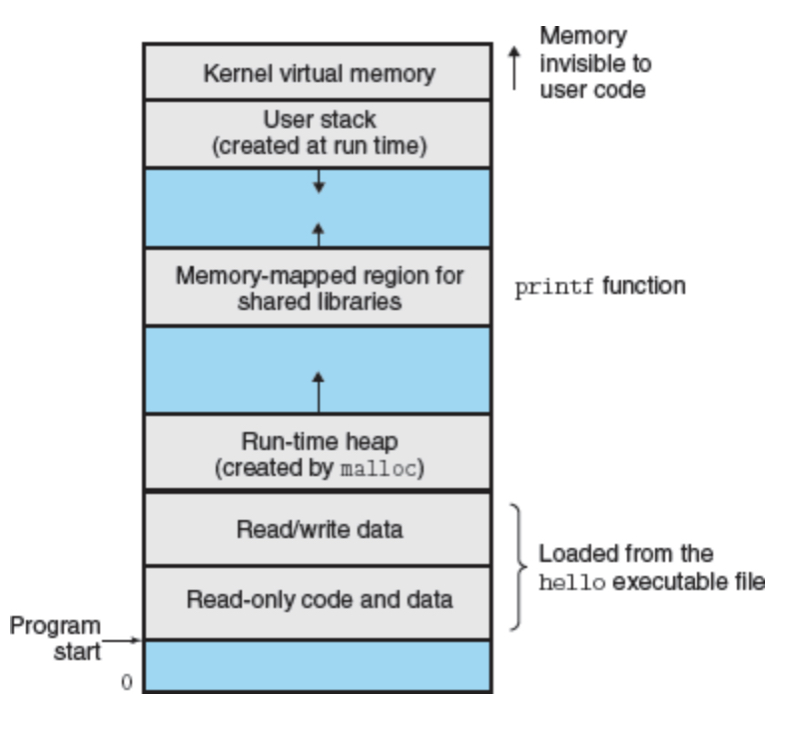

# Chapter 1 A Tour of Computer Systems

## 1.2 Program Translation 
Taking `hello.c` as an example. (A basic "Hello, world." program in C)
- preprocessing phase: all the `.h` files are inserted into the `.c` files and the result is with a `.i` suffix
- Comilation phase: the compiler(`cc1`) translates the text file `hello.i` into the text file `hello.s`
- Assembly phase: the assembler(`as`) translates `hello.s` into machine-language instructions, forming a *relacatable object program*, `hello.o`
- Linking phase: linking `printf.o` with `helo.o`.

## 1.3 Understand how compilation systems work
- Optimizing program performance: x86-64 is the machine-language of recent genrations of Linux, maintosh, and Windows computers.
- Avoiding security holes: avoid buffer overflow vulnerabilities in network and Internet Servers. Never ever accept data directly from untrusted sources.

## 1.5 Caches Matter
Medium speed
- Disk Drive: 1e7 times slower than memory
- Register File: 100 times faster than memory
- L1 Cache: nearly as fast as register file, tens of thousans of bytes.
- L2 Cache: 5 times slower than L1 cache

Caches are implemeted with SRAM(Static Random Access Memory), they depend on locality.

## 1.7 OS
### 1.7.2 Threads
A process can actually consist of multiple execution units, called threads.
