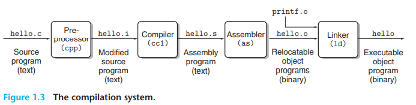

# 1.1 Information is bits+context

```
#include <stdio.h>
int main() {
	printf("hello, world\n");
	return 0;
}
```

这个简单的`hello world`程序`hello.c`是一个源文件，源文件是由一系列的01比特组成的，每8个比特构成一个字节，每个字节又代表了一个字符(char类型的ASCII)

> C语言是在1970年左右由贝尔实验室创造的，K&R描述了ANSI C的细节，所以也被称为"K&R"

# 1.2 Programs are translated by other programs into different forms

`hello world`程序是一个high-level的C语言文件，因为它可以被人类阅读和理解，但要实际运行，这个C语句就要被转换成其他的低级的机器代码，然后打包他们，形成可执行文件，这个转换的过程是编译器完成的工作。

一个典型的流程如下:



|源文件类型 | 命令 | 作用结果 |
| ---- | ----- | ---------- |
|.c  |cpp |预编译(展开宏，替换include) 生成.i 修改的源文件(text) |
|.i  |cc1 |编译 生成.s 汇编文件(text) |
|.s  |as  |汇编 生成.o 重定位文件(binary) |
|.o  |ld  | 其他动态/静态库 ld 链接 生成 可执行文件 |


