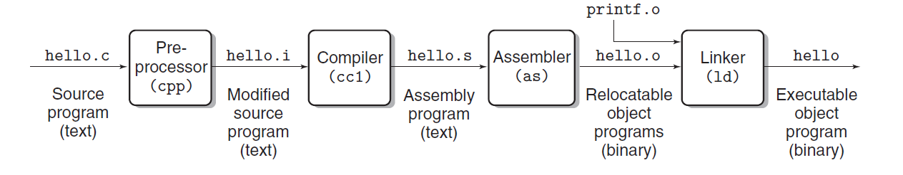
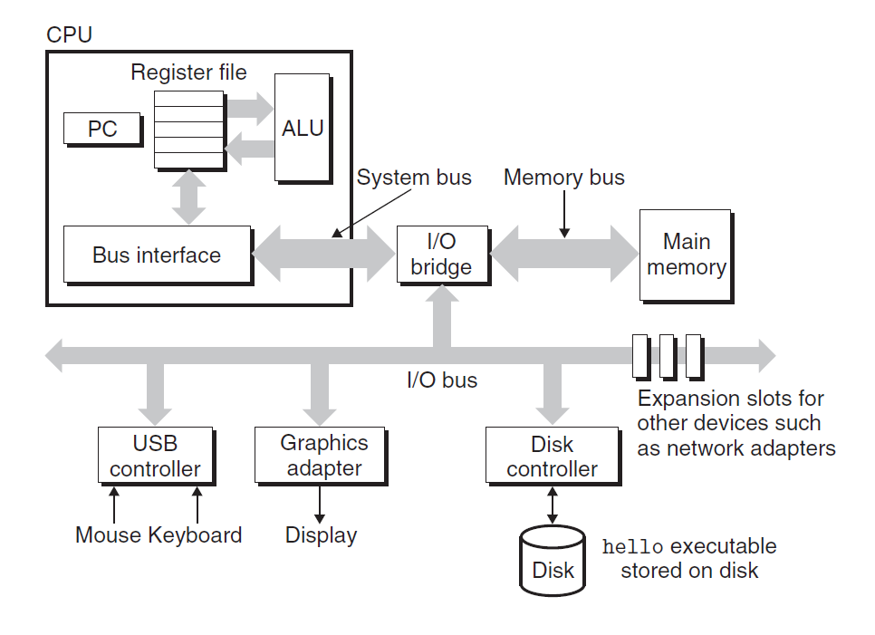
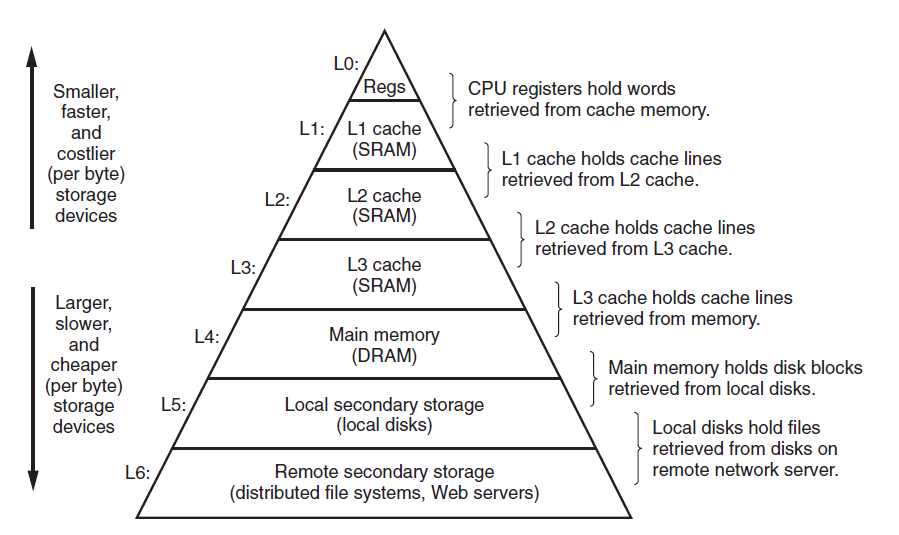
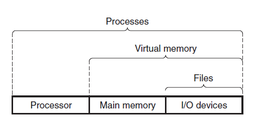

# Ch1 A Tour of Computer System

本章主要以一个简单的 hello world 的 C 程序的执行过程，将所涉及到的计算机硬件及操作系统部分做了一个基本的介绍。

首先，以一个  hello world 的从文本文件到可执行文件的变化过程引入：

主要的过程如下：

1. preprocessing phase：预编译过程。主要是将头文件展开，宏展开等过程；
2. compilation phase：编译过程。主要是将预编译过程生成的代码编译成汇编代码；
3. assembler phase：汇编过程。主要是讲汇编代码生成可重定向的目标码；
4. linker phase：链接过程。将多个可重定向目标码链接成可执行程序。

书中介绍了为何要去理解编译系统的工作过程，稍微总结如下：

1. 优化程序性能，其中的例子如下：
    * switch 和 if  else、while loop 和 for loop  子句的效率问题；
    * 指针和数组下标运算符的效率问题；
    * 函数中自动变量和指针参数的性能问题。
2. 理解链接时出现的错误，例子有：
    * 链接器找不到对应的引用；
    * static 变量 和 global 变量 的区别；
    * 为什么链接相关的错误要到运行期才会出现？
3. 避免程序编写安全问题。
    * 写出健壮的代码，避免 buffer overflow 等问题。

其次，介绍了从 shell 中运行编译好的 hello 程序的过程，对涉及到的硬件做了相应的介绍：

* Buses：总线用于传输固定大小的字（words）；
* I/O Devices：I/O 设备通过 controller 或 adapter 和 I/O 总线相连；
    * controller ： 位于主板中的芯片组中
    * adapter：位于主板插槽中
* Main Memory：DRAM 组成，被组织成大小为 bytes 的线性数组，地址从 0 开始计。
* Processor：CPU 主要有 PC ，ALU，和 寄存器组成。CPU 执行指令的步骤如下：

接着讨论了 Cache 的重要性，主要是存储系统的金字塔图。

操作系统对硬件做了一层虚拟化，分别如下：

1. 进程、线程。书中大致阐述了一下操作系统如何来控制进程的切换，具体详细内容在第八章；
2. 虚拟内存。概括了一下程序的虚拟地址空间；
3. 文件。针对 I/O 设备的虚拟，在 Unix 中，一切皆文件。

