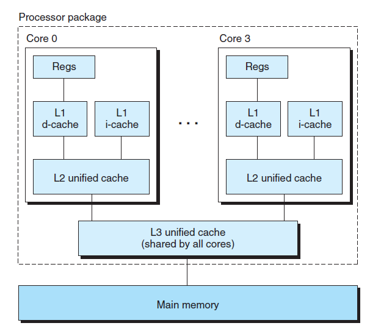
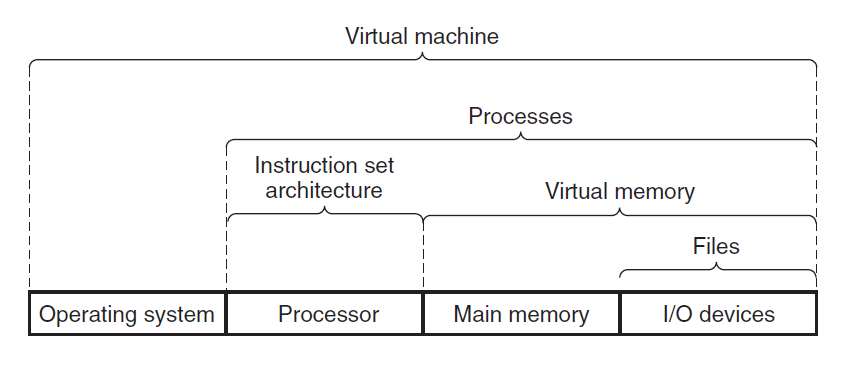

# Ch1 A Tour of Computer System

第一章的结尾部分介绍了计算机系统的几个重要概念。

## Important Themes

### Amdahl's Law

阿姆达尔定律主要指当提升系统一部分性能时，对系统整体性能的影响取决于两个因素：

1. 这一部分的重要程度；
2. 这一部分性能提升了多少。

定律描述如下：
$$
T_{new} = (1 - \alpha) \times T_{old} + (\alpha \times T_{old})  /  k
\\
\\
T_{new} = T_{old}[(1 - \alpha) + \alpha / k]
\\
\\
S = \tfrac{1}{(1 - \alpha) + \alpha / k}
$$
其中，T_{old} 为 一个系统中执行一个程序所需要的时间，其中某部分的时间占比为 a，系统性能提升的倍数为 K。

公式 S  代表的是系统优化后的加速比。

阿姆达尔定律常用来决策系统线程数量的最有值。

### Concurrency and Parallemism

计算机的发展上都是 跑更多程序 和 让程序跑得更快 这两点上。

Concurrency 指的是，系统运行多个程序；而 Parallemism 指的是使用并发技术来提升系统速度。

书中从高到低介绍了三个并发与并行的层次。

#### Thread-Level Concurrency

概述了单处理器到多核心处理器的变化过程。

值得注意的是书中的一个多核心处理器的架构图：

图中的四核处理器，每个核心都有自己的 L1 cache 和 L2 cache。

其中 L1 cache 分为两个部分，d-cache 缓存数据，i-cache 缓存指令。

此外，超线程技术允许一个 CPU 执行多个控制流，在其 CPU 核心上，设置了多个 PC 及寄存器，单仅有一个浮点算数单元。这样使得 CPU 能过在单个周期中执行其他线程。

#### Instruction-Level Parallelism

* Instruction-Level Parallelism 指的是使用流水线技术，使得指令执行的各个步骤并行操作（例如，取指、译码、执行等阶段），这样使得能够在一个时钟周期内保持一条指令的执行速率；
* 超标量处理器：处理器能够达到比一个时钟周期一条指令更快的操作速度。

#### Single-Instruction, Multiple-Data Parallelism

SIMD ，单指令多数据流操作，使得一个指令能并行进行多个操作。

### The Importance of Abstractions in Computer Science

本节主要强调计算机科学中抽象的重要性。

如上图，

* 指令架构集是处理器的抽象，这使得不同型号的处理器能执行同样的机器码;
* 文件是对 I/O 设备的抽象;
* 虚拟内存是对主存的文件的抽象；
* 进程是针对处理器，主存，I/O 设备的抽象；
* 虚拟机则是针对整个操作系统的抽象。

类似采用抽象这一概念的还有计算机网络领域中的 TCP/IP 协议，上层协议不关注底层协议的定义，仅仅将该层协议的数据递送给下层。

