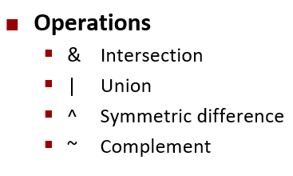
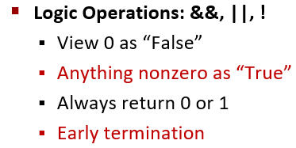
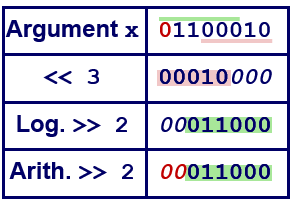
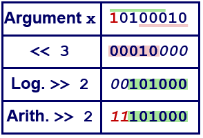
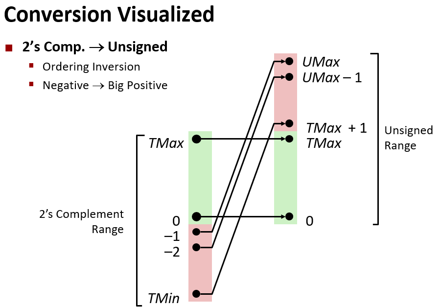
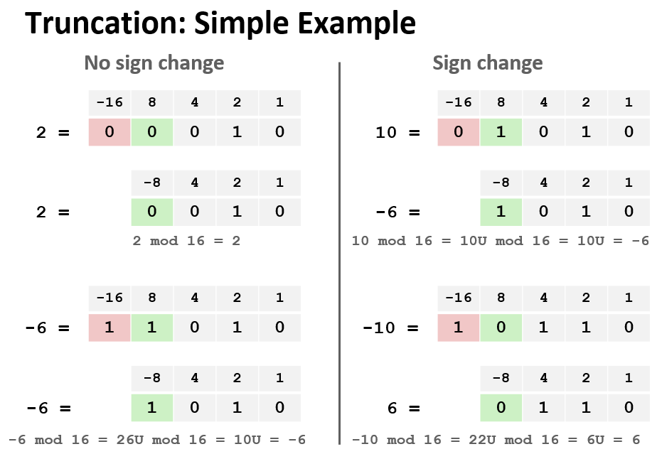

#  Bits, Bytes and Integers – Part 1

##  Sets of Small Integers

Can use vector w to represent a set of w-width integer. An useful trick when dealing with small integers. (<=15)

----
##  Bit-Level Operations & Logic Operations
Contrast to Bit-Level Operators

----
##  Shift Operations
###  Left Shift: 	x << y
* Shift bit-vector x left y positions
    - Throw away extra bits on left
    + Fill with 0’s on right

###  Right Shift: 	x >> y
* Shift bit-vector x right y positions
   + Throw away extra bits on right
* Logical shift
   + Fill with 0’s on left
* Arithmetic shift
   + Replicate most significant bit on left

###  Undefined Behavior(in C programming)
* Shift amount < 0 or ≥ word size
----
##  Encoding Integers
### Signed & Unsigned(Two's Complement)
+ C does not mandate using two’s complement
   - But, most machines do, and we will assume so
+ C short 2 bytes long
  
| Decimal | Hex | Binary |
|:--:|:--:|:--:|
|15213|3B6D|00111011 01101101|
|-15213|C493|11000100 10010011|

+ Sign Bit
   - most significant bit indicates sign

### **Two's Complement Examples**
||| -16 | 8 | 4 | 2|1|total|
|--|--|:--:|--|--|--|--|:--:|
|10|=|0|1|0|1|0|8+2=10|
|-10|=|1|0|1|1|0|-16+4+2=-10|

### Numeric Ranges, W = 8
||Min|Max|Minus 1|
|:--:|:--:|:--:|:--:|
|Unsigned Values|0|2w-1|/|
|Unsigned Binary|00000000|11111111|/|
|Two's Complement Values|-2w-1|2w-1-1|-1|
|Two's Complement Binary|10000000|01111111|11111111|

----
## Conversion, 2's Comp <--> Unsigned

----
## Casting Rules

+ Bit pattern is maintained
+ But reinterpreted
+ Can have unexpected effects: adding or subtracting 2w
+ Expression containing signed and unsigned int
   - int is cast to **unsigned**

## Expanding & Truncating

+ Expanding (e.g., short int to int)
  - Unsigned: zeros added
  - Signed: sign extension
  - Both yield expected result

+ Truncating (e.g., unsigned to unsigned short)
  - Unsigned/signed: bits are truncated
  - Result reinterpreted
  - Unsigned: mod operation
  - Signed: similar to mod
  - For small (in magnitude) numbers yields expected behavior

