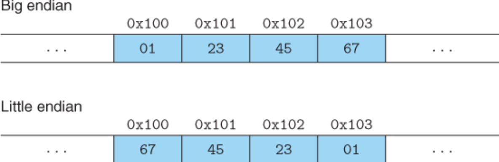
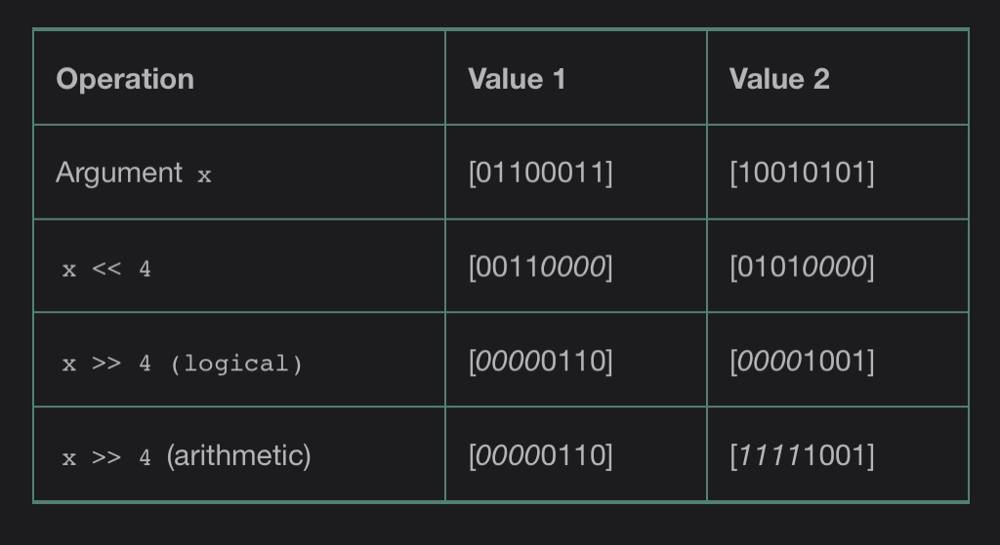

## 2.1 Information Storage

The C compiler associates type information with each pointer, and machine-level code is generated based on the pointer type.

### 2.1.2 Data Sizes

Every computer has a word size, indicating the nominal size of pointer data.

A 32-bit word size limits the virtual address space to 4 GB.

### 2.1.3 Addressing and Byte Ordering

Representation of `0x1234567`

 



- Little-endian: Intel-compatible machines
- Big-endian: IBM and Oracle machine

ARM microprocessors can operate in both little- and big-endian mode. But Android and iOS only operate in little-endian mode.

Network applications must pay attention to the endianness between different machines.

### 2.1.5 Representing Code

Program libraries are also available for C to support Unicode.

### 2.1.6 Intro to Boolean Algebra

Boolean ring:

`a ^ a = 0`

Bit vectors can be used to represent finite sets.

### 2.1.7 Bit-Level Operations in C

```c
void inplace_swap(int *x, int *y {
	*y = *x ^ *y;
	*x = *x ^ *y;
	*y = *x ^ *y;
}
```

- `bis`: bit set. Set each bit to 1 at each position where m is 1.
- `bic`: bit clear. Set each bit to 1 at each position where m is 0.

```c
int bis(int x, int m);  // bit set
int bic(int x, int m);  // bit clear

int bool_or(int x, int y) {
	int result = bis(x, y);
	return result;
}

int bool_xor(int x, int y) {
	int result = bis(bic(x, y), bic(y, x));
	return result;
}
```



- Signed Data: arithmetic right shift
- Unsigned Data: logical right shift