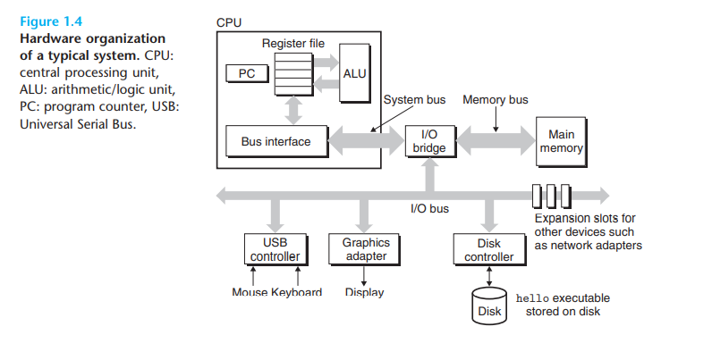

# 1.3 It Pays to Understand How Compilation Systems Work

一些原因为什么程序员需要理解编译器是如何工作的:

- switch一定比if else 快？
- 一个function call 会带来多少的overhead
- pointer reference 一定比 slice access 快？

## 理解链接错误

一些问题:

- static 变量 和 global 变量的区别
- 当在不同的C文件中定义了两个同名global 会有什么问题
- 静态lib和动态lib的区别

## 减少安全漏洞

比如 buffer overflow

# 1.4 Processors Read and Interpret Instructions Stored in Memory

## 1.4.1 Hardware Organization of a System

硬件结构由总线，IO设备，内存，处理器组成

- IO设备通过controller或者adapter连接到bus上面区别是: 控制器是片上的device，或者在主板上的，而适配器是一个类似于插卡的东西插到主板上。

## 1.4.2 Running the hello Program

一开始，shell会执行它的指令，等待用户输入命令，当执行`./hello`时，敲击完回车建，shell知道结束了，然后装载可执行的load文件，具体而言就是
copy这个可执行文件的指令和数据到内存相应的位置，然后执行。

如果使用了DMA，那么数据就会直接从disk到内存，而不需要处理器交互。