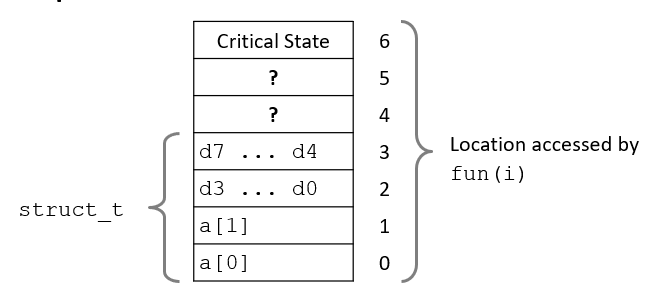

# Overview part-1

## Memory Matters
### Memory is not unbounded
+ It must be allocated and managed
+ Many applications are memory dominated
### Memory referencing bugs especially pernicious
+ Effects are distant in both time and space
### Memory performance is not uniform
+ Cache and virtual memory effects can greatly affect program performance
+ Adapting program to characteristics of memory system can lead to major speed improvements
----
## Memory Referencing Errors
+ C and C++ do not provide any memory protection
  - Out of bounds array references
  - Invalid pointer values
  - Abuses of malloc/free
+ Can lead to nasty bugs
  - Whether or not bug has any effect depends on system and compiler
  - Action at a distance
     * Corrupted object logically unrelated to one being accessed
     * Effect of bug may be first observed long after it is generated
----
## Memory Referencing Bug Example
```c []
typedef struct {
  int a[2];
  double d;
} struct_t;

double fun(int i) {
  volatile struct_t s;
  s.d = 3.14;
  s.a[i] = 1073741824; /* Possibly out of bounds */
  return s.d;
}
```
|output|value|
|:--|:--|
|fun(0)|3.14|
|fun(1)|3.14|
|fun(2)|3.1399998664856|
|fun(3)|2.00000061035156|
|fun(4)|3.14|
|fun(6)|Segmentation fault|

Explanation:

`struct_t`定义了一个长度为2的`int8`数组以及`double d`变量，系统默认给`struct_t`分配了连续的6个字节的函数栈。执行`fun(6)`时，`a[6]`已经超出了函数栈的范围，会报错越界`Segmentation fault`。

但是`fun(i), i ∈ [1~5]`时，由于函数栈没有越界，因此编译器不会报错，但是此时结果已经出错。



----
## Memory System Performance Example
```C
void copyij(int src[2048][2048],
            int dst[2048][2048])
{
  int i,j;
  for (i = 0; i < 2048; i++)
    for (j = 0; j < 2048; j++)
      dst[i][j] = src[i][j];
}

```
```C
void copyji(int src[2048][2048],
            int dst[2048][2048])
{
  int i,j;
  for (j = 0; j < 2048; j++)
    for (i = 0; i < 2048; i++)
      dst[i][j] = src[i][j];
}

```
访问多维数组的方式不同导致`copyij`和`copyji`的运行速度相差20倍。