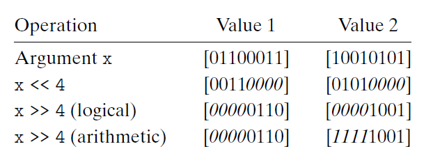

# Ch2 Representing and Manipulating Information

## 2.1 Information Storage

布尔代数

* Unix 中信号屏蔽字用 bit vector 进行布尔运算来区别某特定信号是否启用；
* 注意 C 中的 布尔运算符 和 逻辑运算符。逻辑运算符具有 "短路" 的性质，例如 "A && B"  或者 "A || B" 会在第一项求值满足条件后不再对第二项进行求值判断。

移位运算

* 注意区分逻辑右移和算数右移。

    * 逻辑右移：移位时，二进制表示中高位补 0；
    * 算术右移：移位时，二进制表示中高位补符号位；
    * C 标准未精确定义移位运算采用哪种方案。但是大多数编译器针对 signed 类型进行算数右移，而 unsigned 类型采用 逻辑右移。

    

