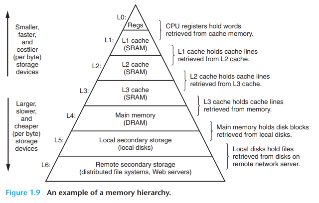

# 1.5 Caches Matter

因为寄存器的访问大约是100倍快于主存，所以我们希望有这样一个区域可以介于register和memory，通常L1cache大约只有几十kB，并且它的访问速度可以和寄存器相当。而一个更大的L2cache可能会有几个MB大，但是如果L1miss了，L2hit那么可能需要多花几个cycles。不过L2cache应该仍然比访问主存要块10倍左右。

L1 和 L2 cache使用的是SRAM，现在可能还会有L3cache，用cache的原因主要是充分发挥局部性原理。

# 1.6 Storage Devices From a Hierarchy

cache 其实是一个很general的想法，它往往可以用于在一个快而容量小与慢而容量大之间的中间层。

# 1.7 The Operating System Manages the Hardware

当运行hello这个文件时，既不是shell进程也不是hello这个进程直接的去管理键盘，显示，硬盘，内存等等。他们依赖于操作系统完成，我们可以认为OS是在应用层和硬件的一个软件桥梁。所有试图操作硬件都将会由OS帮助我们完成。

## 1.7.1 进程

单核CPU也可以做到并发，但需要上下文切换，它包括了PC，寄存器，内存。在任意时刻，单核cpu只能运行一个进程。
以shell与hello world为例子，当我们运行shell时，他一开始是独立地在运行，当我们运行hello时，shell会执行一个系统调用，并传递给操作系统。这个时候OS会保持shell当前的上下文，然后执行hello进行，并读取他的上下文。

kernel 是操作系统一部分代码，永远位于memory中，kernel并不是一个单独的进程，而是一些code和data用来帮助管理进程的

