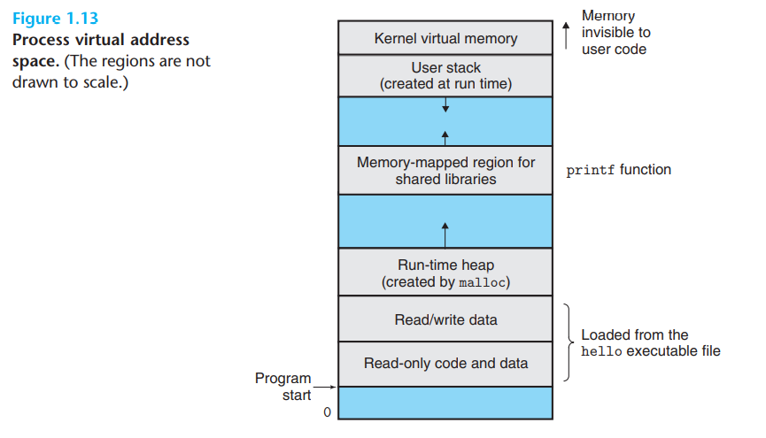
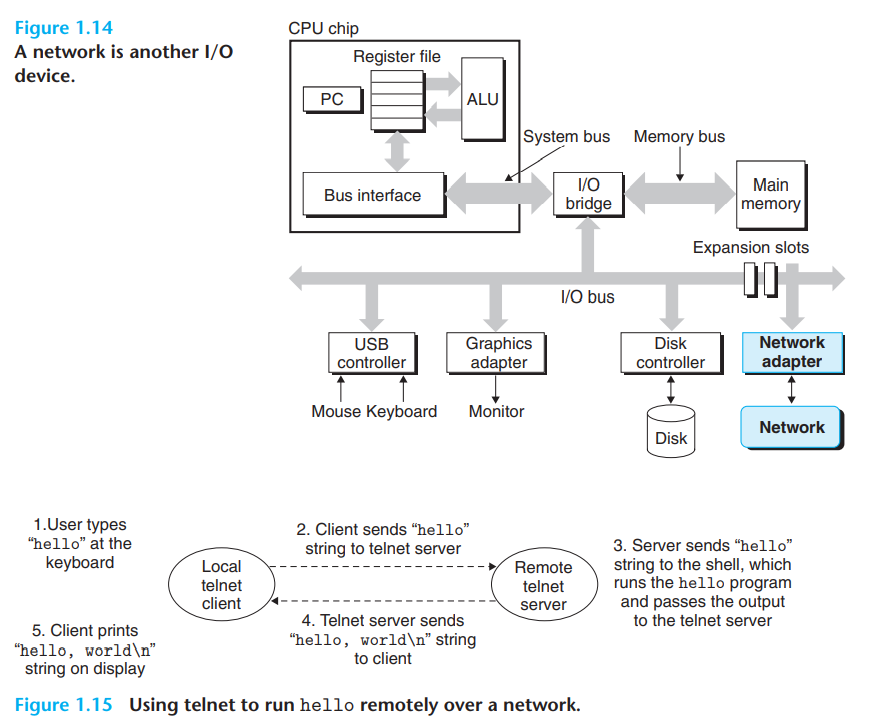

## 1.7.2 Threads

Threads 对于网络并发是十分重要的，因为对于多个线程来说，可以更方便的共享数据

## 1.7.3 Virtual Memory

每个进程都拥有相似的内存空间分布:

由低到高分别是text段，data段，malloc的空间，动态库，栈(高到低)以及kernel的虚拟内存空间(不可用)

## 1.7.4 Files

文件由一系列的bytes构成，每个I/O设备都可以看作是一个文件

## 1.8 System Communicate with Other Systems Using Networks

