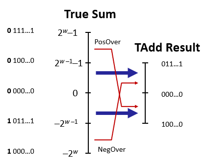

# Bits, Bytes, & Integers II
## Addition
### Unsigned Addition
+ Standard Addition Function
  - Ignores carry output
+ Implements Modular Arithmetic
  - s = UAdd<sub>w</sub>(u, v) = (u + v) mod 2<sup>w</sup>

### Two’s Complement Addition
+ TAdd and UAdd have Identical Bit-Level Behavior
  - Signed vs. unsigned addition in C:
  
``` C
int s, t, u, v;
s = (int) ((unsigned) u + (unsigned) v);
t = u + v
```

  - Will give `s == t`

### TAdd Overflow
- True sum requires w+1 bits
- Drop off MSB
- Treat remaining bits as 2’s comp. integer



### Characterizing TAdd
+ Functionality
  - True sum requires w+1 bits
  - Drop off MSB
  - Treat remaining bits as 2’s comp. integer


----
## Multiplication
+ Goal: Computing Product of w-bit numbers x, y
  - Either signed or unsigned
+ Exact results can be bigger than w bits
  - Unsigned: up to 2w bits
  - Result range: 0 ≤ x * y ≤ (2<sup>w</sup> – 1)<sup>2</sup> = 2<sup>2w</sup> – 2<sup>w+1</sup> + 1
  - Two’s complement min (negative): Up to 2w-1 bits
  - Result range: x * y  ≥ (–2<sup>w–1</sup>)*(2<sup>w–1</sup>–1)  =  –2<sup>2w–2</sup> + 2<sup>w–1</sup>
  - Two’s complement max (positive): Up to 2w bits, but only for (TMinw)2
  - Result range: x * y ≤ (–2<sup>w–1</sup>)<sup>2</sup>  =  2<sup>2w–2</sup>
+ Maintaining exact results needs to:
  - keep expanding word size with each product computed
  - is done in software, if needed. 
  - e.g., by “arbitrary precision” arithmetic packages

### Unsigned Multiplication in C
|||
|--|--|
|Operand|w bits|
|True Product|2*w bits|
|Discard|w bits|
+ Standard Multiplication Function
  - Ignores high order w bits
+ Implements Modular Arithmetic
  - UMult<sub>w</sub>(u , v) = u·v mod 2<sup>w</sup>

### Signed Multiplication in C

Same as unsigned multiplication but seem  most significant bit as signed bit

### Power-of-2 Multiply with Shift
|||
|--|--|
|Operand|w bits|
|True Product|w+k bits|
|Discard|w bits|
Same as x * 2<sup>k</sup>
----
## Negation
----
## Shifting