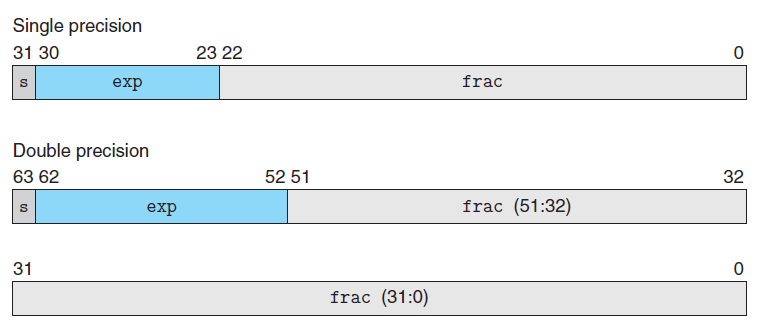
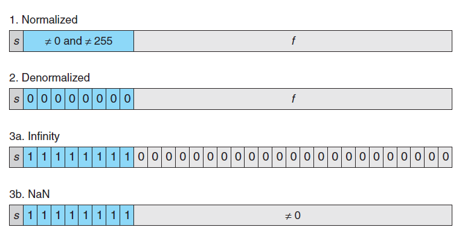

# Ch2 Representing and Manipulating Information

## 2.4 Floating Point

浮点数表示需要注意：

* 处理舍入、上溢出、下溢出问题；
* 如何在硬件上做快速运算。

IEEE 754 规定的浮点数表示规则如下：

* 符号位 s：决定正负；
* 尾数 M：二进制小数，范围是  $1 \sim 2 - \epsilon$ 或者 $0 \sim 1 - \epsilon$ ;
* 阶码 E：用于对尾数进行加权，$E = 1 - Bais$ ，$ Bias = 2^{k - 1} - 1$ ，$k$ 为阶码位数。

根据 s，M 和 E 的不同，存在不同类型的表示方法：

1. Normalized Values

    阶码 E 不能位全 0 或者 全 1；小数字段默认隐藏了一个 1，即 $M = 1 + f$ ；

2. Denormalized Values

    阶码 E 为全0，尾数为 $M = f$，不含隐藏的开头的 1；这样表示是为了：

    * 表示数值 0 的方法；因此根据符号位的不同，有± 0 的区别；
    * 表示接近 0 的数，提供了一种叫做逐渐溢出（gradual underflow）的属性；

3. Special Values

    为了表示一些特殊值：

    * 正无穷大和负无穷大，可以当作运算溢出的结果；
    * Nan ( Not a Number )；

一些值得注意的点：

* Denormalized Values 到 Normalized Values 的转变，取决于将 E 定义为 $E = 1 - Bais$ ，这样使得能在转变的时候特殊判断，使得 Normalized Values 做一个 $M = 1 + f$ ，整个转变较为平滑；
* 阶码当作无符号数时，整个数的表示范围按照升序排列，使得浮点数做比较时更加方便。

