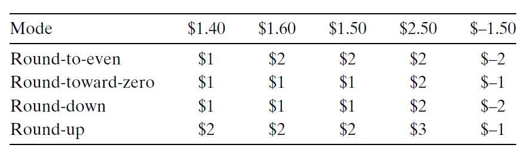

# Ch2 Representing and Manipulating Information

## 2.4 Floating Point

浮点数的舍入操作：

* 向偶数舍入：将数字向上或者向下舍入，使得数字的最低有效数字是偶数；
* 向零舍入：正数向下舍入，负数向上舍入，得到 $\hat{x}$，且 $\lvert \hat{x} \rvert \leq \lvert x \rvert$；
* 向下舍入：正数和负数都向下舍入，得到 $x^{-}$，且 $ x^{-} \leq x$；
* 向上舍入：正数和负数都向上舍入，得到 $x^{+} $，且 $ x \leq x^{+} $。

具体例子如下：

浮点运算：

* 浮点数加法：支持交换律，不支持结合律，满足单调性
* 浮点数乘法：支持交换律、分配律、不支持结合率，满足单调性

编译器为了满足浮点运算的精确度，一般不会对浮点运算做优化。

C 中的浮点数：

int、float、double 相互转换时遵循以下原则：

* int 转换为 float，不会发生溢出，但是可能舍入；
* int 或者 float 转换为 double，能保留精确的数值；
* double 转换为 float，可能会发生溢出、舍入；
* float 或者 double 转换为 int，可能会向 0 舍入、溢出

