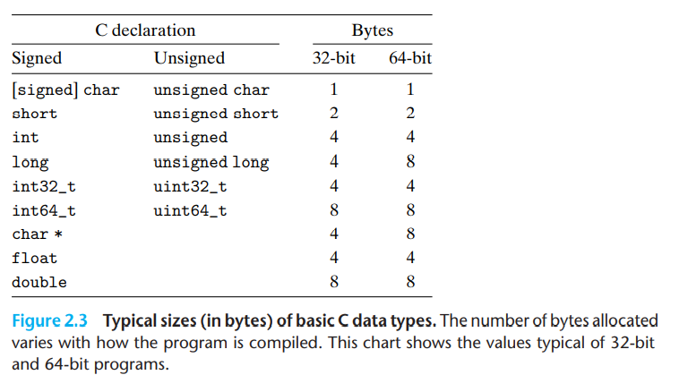
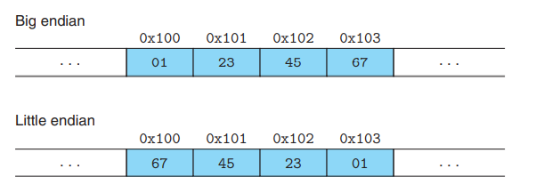

# 2.1 Information Storage

## 2.1.1 Hexadecimal Notation

## 2.1.2 Data Sizes(end with Page 81)

每个电脑都有一个word size，如32bit是4GB，而64bit是16EB, 64位的机器也可以编译32位的文件, 命令如下:

    $ gcc -m32 program.c

然后这个程序应该在32/64位系统上都可以正常运行

主要的区别是64位上指针是8bit，然后long的长度也是8bit了。

为了避免一些兼容性的问题，可以使用`int32_t`和`int64_t`

以下声明都是一回事:

- unsigned long
- long unsigned
- unsigned long int
- long unsigned int

little endian: 低位先， big endian: 高位先。

一般而言，大小端对于普通程序员不是可见的，但是在网络中，收发大小端不一致就会带来问题，详情见Chap11。

另一种case是字节如何表示一个interger，如果是小端的话需要反着读。

最后一种情况是，在C语言中使用cast或者union，让一个变量强行表示成另一个变量。
