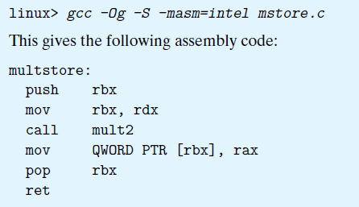

# Ch3 Machine-Level Representation of Programs

## 3.2 Program Encodings

gcc 通过下列命令进行程序编译：

```
gcc -Og -o p1.c -p2.c
```

其中：

* `-Og` 告诉编译器生成符合原始 C 代码结构的机器代码的优化等级；
* 整个命令的执行过程如下：
    1. C预处理器扩展源代码，插入 `#include` 文件，展开 `#define` 宏；
    2. 编译器产生两个源文件的汇编代码，扩展名为 `.s`；
    3. 汇编器将汇编代码转换成二进制目标代码文件，扩展名为`.o`；
    4. 链接器将目标代码重定位，产生最终的可执行文件。


机器级编程，着重强调了计算机系统的以下两种抽象行为：

1. ISA（指令集体系结构）定义的机器级程序的格式和行为，包含了处理器状态，指令的格式，以及每条指令对状态的影响。
2. 机器及程序使用的内存地址是虚拟地址，OS 负责虚拟地址到物理地址的翻译。


以下 C 程序隐藏的处理器状态，在汇编程序中都是可见的：

* 程序计数器（PC，在 `x86-64` 中用 `%rip` 表示），表示下一条指令在内存中的位置；

* 寄存器（`x86-64` 中 16 个寄存器，分别存储 64 位的值），可以用来存储内存地址，也可以存储数据；

* 条件码寄存器，用于保存最近算数或者逻辑指令的状态信息，用于控制或数据流中的条件变化；

* 向量寄存器，用于存储多个整数或者浮点数。


编译器和反汇编器的使用，具体见下图：


具体细节如下：

* `x86-64 ` 的指令长度从 1 到 15 个字节不等，常用的指令或者是操作数少的指令所需的字节数较少；
* 反汇编器根据目标代码的字节序列来确定汇编代码；生成的汇编代码与原来程序的汇编代码相差无几。


gcc 产生的汇编代码会存在一些 `.` 开头的行，这些行是用于指导汇编器和链接器工作的伪指令，在阅读时可以忽略。

存在一些应用程序，有时候会使用汇编代码去访问机器的低级特性，有时候混合 C 和汇编代码进行编程；此外，gcc 还还提供了一些汇编代码给用户调用，例如`__builtin_pop_count` 用于计算某个数的二进制表示中位为1 的个数。


ATT 和 Intel 汇编的差距，可以用下图指令来得到 Intel 风格的汇编：



* gcc，objdump 工作默认使用 ATT 风格汇编；
* Intel 风格汇编忽略了用于指示操作字长的后缀；
* Intel 风格汇编忽略了寄存器前缀 `%s` 符号；
* Intel 风格汇编用了其他风格代码来描述内存位置，比如 `QWORD PTR [rbx]` ，ATT 中则直接使用 `(%rbx)`;
* Intel 更改汇编在多操作数指令下，列出操作数的顺序和 ATT 风格汇编相反。


