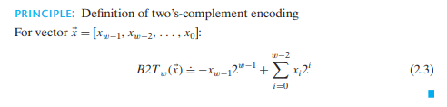

## 2.1.8 logical operations in C

`||` `&&` 和 `!` 把非0值当作`TRUE`,而把0值当作`FALSE`,他们只会返回**1或0**。

## 2.1.9 shift operations in C

左移一定是补零的，右移则可能是补零(logical),或者根据最高位(arithmetic)。

C标准并没有精确地定义右移究竟是补零还是补最高位，但是一般的编译器选择都是补最高位，对于无符号数而言，那就是补零。

Java拥有更精准的定义，`x >> k` 是算术补， `x >>> k`是逻辑补。

# 2.2 Integer Representations

## 2.2.3 Two's-Complement Encodings

## Aside More an fixed-size integer types

> 正确打印int32_t,int64_t的方法如下`%" PRId64"`,注意c++11中，左空格是必须的，C语言可以没有。

