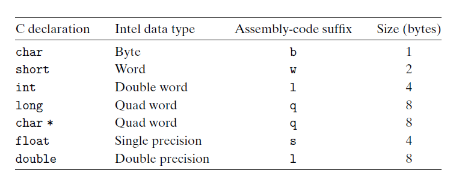
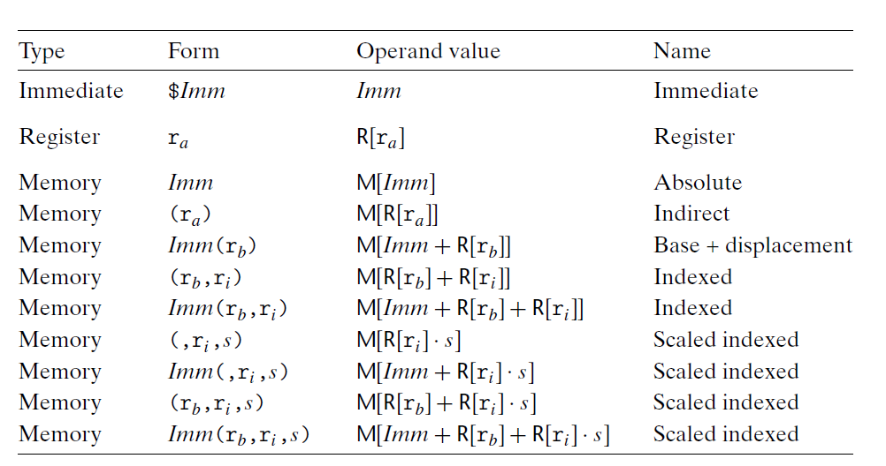

# Ch3 Machine-Level Representation of Programs

## 3.3 Data Formats

Intel 处理器中：

* 字，word，16 bit
* 双字，double words，32 bit
* 四字，quad words，64 bit

64 位机器下，C 类型在 x86-64 中的大小如下图：

## 3.4 Accessing Information

一个 x86-64 的 CPU 包含了 16 个 64 bit 的通用寄存器，这些寄存器可以用来存储数据和指针，具体见下图。

* 寄存器名字的变化历史如下：

    * 最早的 8086 处理器中有 8 个 16 位寄存器，即上图中的 `%ax` 到 `%sp`；
    * 扩展到 IA32 架构以后，扩展成了 32 位寄存器，分别为 `%eax` 到 `%esp` ；
    * 扩展到 x86-64 后，原来的 8 个寄存器扩展到 64 位，添加了另外新的 8 个寄存器，分别为 `%r8` 到 `%r15`。

* 根据寄存器位数的不同，指令也可以分别访问低 1、2、4、 8 个字节（如上图嵌套所见），如果寄存器为目标时，如果操作小于 8 字节的指令，有两种规则进行处理：

    * 生成 1 字节和 2 字节数字的指令会保持剩下字节不变；
    * 生成 4 字节的指令会把高位 4 个字节置 0 。

* `%rsp` 栈指针用于指明栈的结束位置。

    

**操作数指示符**

指令的操作数通常由下图中的规则决定：

操作数的来源：

* 源操作数来源：立即数、内存、寄存器；
* 目的操作数来源：寄存器、内存。

寄存器：一般用 $r_{a}$ 表示某个寄存器，引用 $R\left [ r_{a} \right]$ 来表示其值；

内存引用：

* 一般将内存看作一个大的字节数组，用 $ M_{b}\left [ Addr \right] $ 来表示存储再内存地址 $Addr$ 开始的 b 个字节值的引用。
* 同时，为了方便引用数组或者结构体类型时，使用 $Imm\left( r_{b}, r{i}, s\right)$ ，$Imm$ 为立即数偏移，$r_b$ 为基址寄存器，$r_s$ 为变址寄存器，$s$ 为扩大因子。

