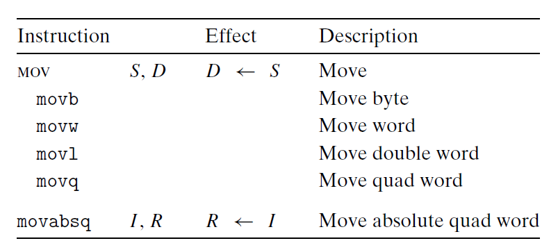
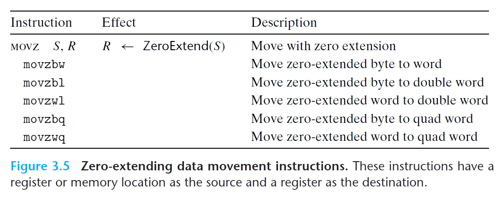
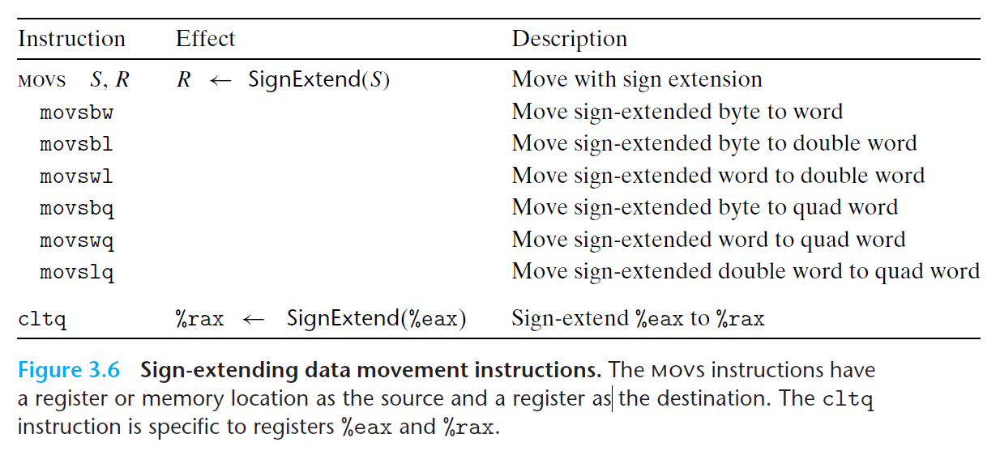
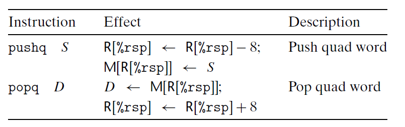

# Ch3 Machine-Level Representation of Programs

## 3.3 Accessing Informations

**数据传送指令**

$MOV$类指令：主要区别在于其操作数的大小不同。



* 源操作数：立即数、内存地址、寄存器
* 目的操作数：内存地址、寄存器
* $mov$ 指令的两个操作数**不能同时指向内存位置**。将一个值从一个内存位置复制到另一个内存位置需要两条指令，第一条指令需要内存位置的初始值加载到寄存器中，然后将寄存器的值写入到目标位置。
* $mov$ 指令的最后一个**字符**必须和寄存器类型相匹配。
* 大多数情况下，$mov$ 指令只会更新目的操作数指定的寄存器字节或内存地址；但 $movl$ 指令以寄存器做为目标操作数时，会将高 4 位字节设置位 0。（原因是 x86-64 中，任何为寄存器生成 32 位值的指令会把寄存器的高位部分置 0）。


此外，还有两组 $mov$ 类似的指令，分别是 $movz$ 类 和 $movs$ 类。在将较小的源值复制到较大的目的上时，

* $movz$ 将目的中的剩余字节填充位 0；

* $movs$ 将目的中的剩余字节通过符号位的扩展来填充。






**压入和弹出栈数据**

压栈和弹栈的指令如下：



* 栈指针 `%rsp` 保存着栈顶元素的地址；

* `pushq %rbp` 等价于：

    ```assembly
    subq $8, %rsp
    movq %rbp, (%rsp)
    ```

* `popq %rax` 等价于：

    ```assembly
    movq (%rsp), %rax
    addq $8, %rsp
    ```

    

* 由于栈和其他程序代码都是存放在同一内存中，所以程序都可以用标准内存寻址方法来访问栈内的任意位置。

​    

