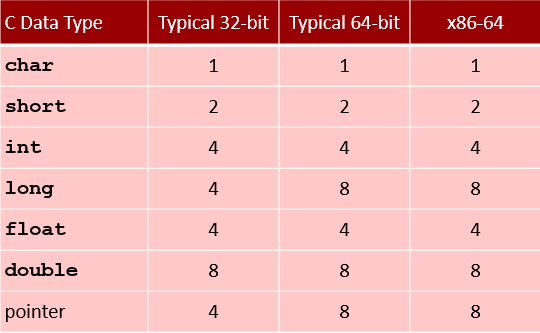
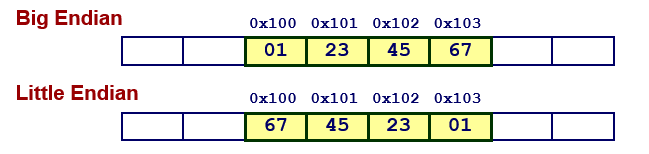

# Representations in memory, pointers, strings

## Byte-Oriented Memory Organization

### Programs refer to data by address
+ Conceptually, envision it as a very large array of bytes
  - In reality, it’s not, but can think of it that way
+ An address is like an index into that array
  - and, a pointer variable stores an address

### System provides private address spaces to each “process”
+ Think of a process as a program being executed
+ So, a program can clobber its own data, but not that of others

### Machine Word Size

|Size|Limit Addresses|Index|
|--|--|--|
|32 bits|4GB|232|
|64 bits|18EB ≈ 1.8*1018|264|

+ Machines still support multiple data formats
  - Fractions or multiples of word size
  - Always integral number of bytes

## Byte Ordering
### Conventions
+ Big Endian: Sun (Oracle SPARC), PPC Mac, **Internet**
  - Least significant byte has highest address
+ Little Endian: **x86**, ARM processors running Android, iOS, and Linux
  - Least significant byte has lowest address

+ Example
  - Variable x has 4-byte value of 0x01234567
  - Address given by &x is 0x100

## Representing Pointers
- Different compilers & machines assign different locations to objects
- Even get different results each time run program
## Representing Strings
- Strings in C
  + Represented by array of characters
  + Each character encoded in ASCII format
    * Standard 7-bit encoding of character set
    * Character “0” has code 0x30
      - Digit i has code 0x30+I
    * man ascii for code table
  + String should be null-terminated
    + **Final character = 0**
- Compatibility
  - Byte ordering not an issue

  
 
