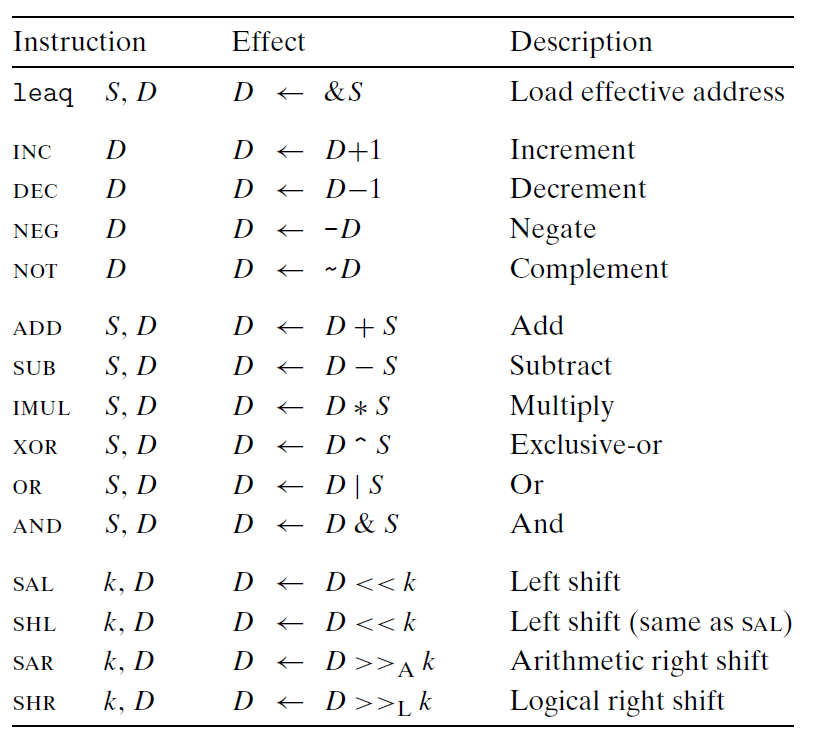
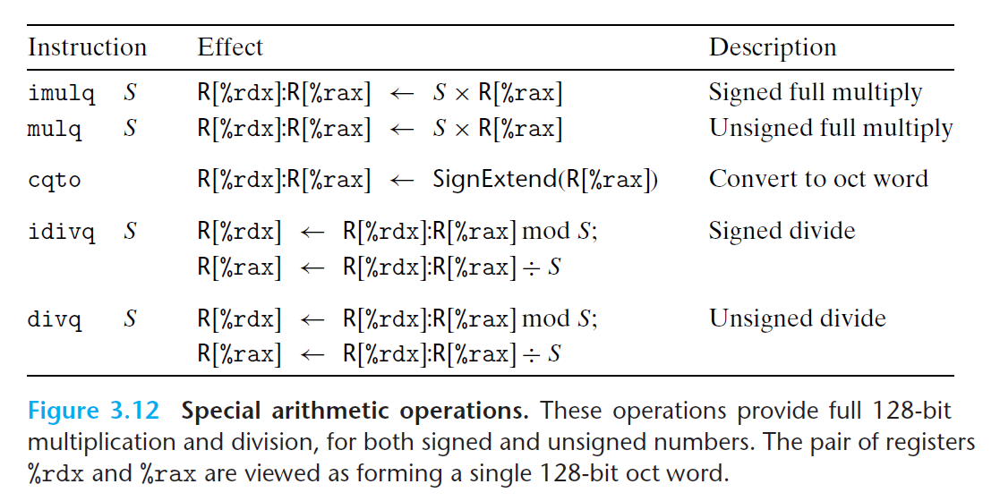

# Ch3 Machine-Level Representation of Programs

## 3.5 Arithmetic and Logical Operations

算术和逻辑运算包括加载有效地址、一元运算，二元运算、移位运算。

**加载有效地址**

$leap$ 指令被用来完成：

* $leaq$ 指令从内存地址读数据到寄存器，并未引用内存；类似于 $mov$ 指令；

* 进行普通的算数操作。

**一元和二元运算**

* 一元运算符的操作数，可以是内存地址或者是寄存器；
* 二元运算符的操作数，其第二个操作数会存储最后的结果；

**移位运算**

* 移位运算的移位量，可以是一个立即数，也可以存放在单字节寄存器 `%cl` 中。
    * x86-64 中，移位操作对 w 位长的数据进行操作，移位量是由 `%cl` 寄存器的低 m 位决定的，$2^m = w$ ，高位会被忽略。

**特殊的算术操作**

主要是一些八字（oct word）相关的算数操作。

$imul$ 乘法操作的两个操作数都为 64 位时，其结果会阶段到 64 位。

因此，x86-64 提供了特殊的算数操作。

$mulq$ 和 $imulq$ 要求一个参数放在 `$rax` 中，另外一个为源操作数，乘积的结果的高 64 位存放在 `%rdx` 中，低 64 位存再 `%rax` 中。

对于除法操作和取模操作；

除法操作 $idivl$ 将把 128 位被除数的高 64 位存在寄存器 `%rdx` 中，低 64 位存在`%rax` 中；除法为另一个操作数；商存储在 `%rax`，余数存储在 `%rdx` 中。

如果被除数为 64 位的值，那么被除数存放在 `%rax` 中，`%rdx` 应该设置为 0 （无符号运算）或者 `%rax` 的符号位（有符号运算）；补 0 或者补符号位的运算可以由 $cqto$ 指令完成，其隐式的读 `%rax` 的符号位，并将其复制到 `%rdx` 的所有位。

无符号除法直接使用 $divq$ ，寄存器 `%rdx` 会被默认设置为 0。

