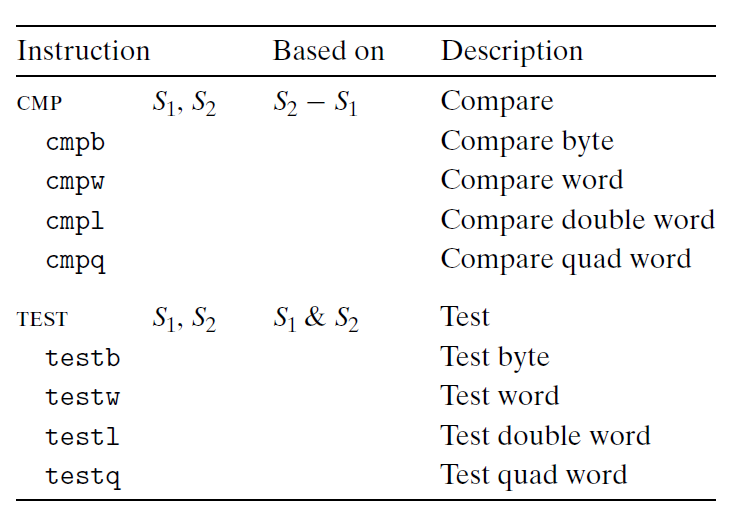
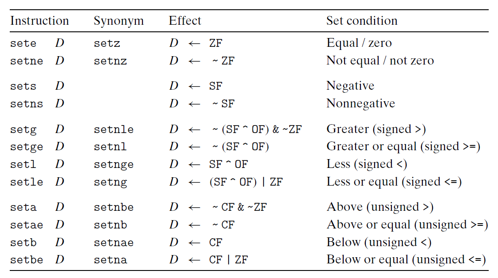

# Ch3 Machine-Level Representation of Programs

## 3.6 Control

机器代码根据值的测试结果来改变控制流或者数据流。

**条件码**

CPU 为最近的算术运算和逻辑运算维护了一组单个位的条件码寄存器。

> $leaq$ 不会改变条件码，其用来进行地址计算。

常见的条件码有：

* CF，Carry Flag
* ZF，Zero Flag
* SF，Sign Flag
* OF，Overflow Flag

其中，有符号数和无符号数的溢出表示不一样，有符号数置 OF 位表示溢出，无符号数置 CF 位表示溢出。

此外，$cmp$ 和 $test$ 类指令也会设置条件码，但这两类指令不会更新寄存器的值。

**访问条件码**

通常不直接读取条件码，一般通过以下三种方法来使用条件码：

* 根据条件码的相关组合，将某个字节置 0 或置 1；用 $set$  类指令来设置；
* 用于条件跳转到程序的其他部分；
* 用于有条件的传输数据。

$set$ 类指令的目的操作数是低位单字节寄存器元素，或者是一个字节长的内存地址。

通过 $set$ 类指令访问条件码，获取算术运算或逻辑运算的相关信息，例如，操作数是否为 0，两个操作数的大小等。

