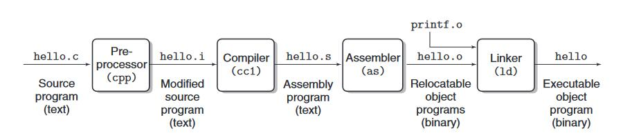
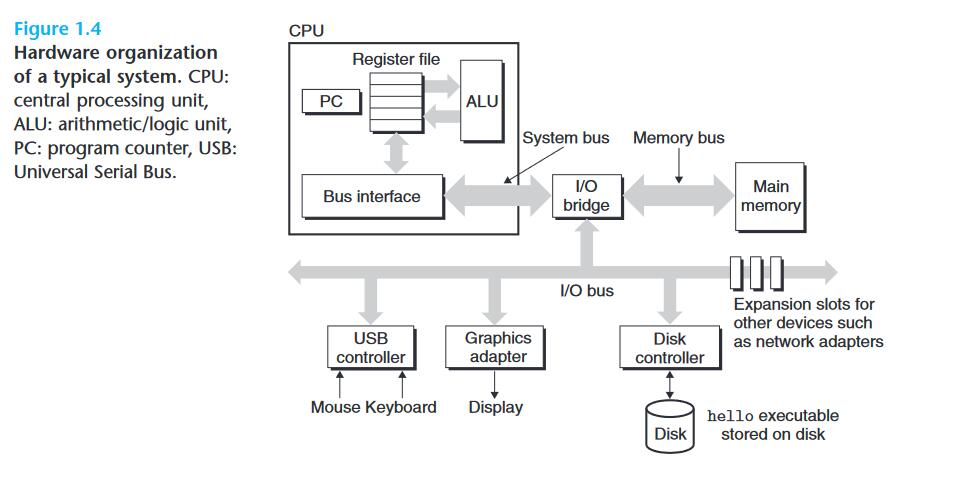
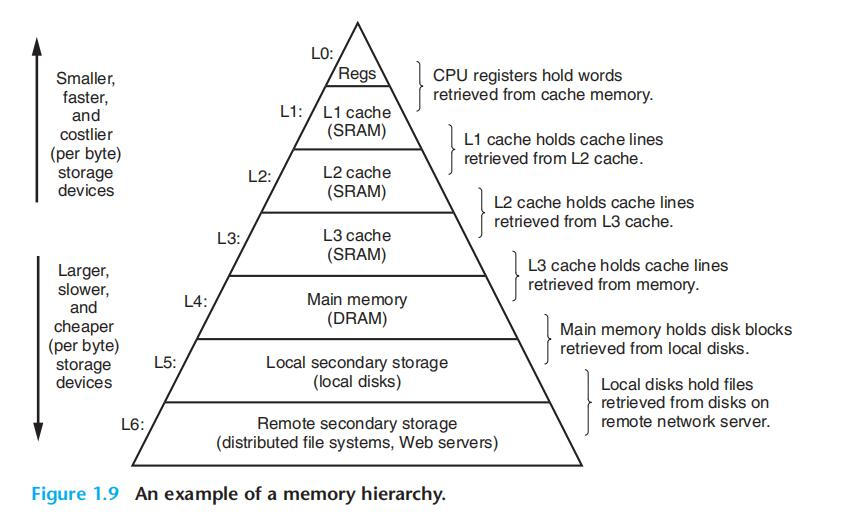

# Chapter.1 概述

--------------

## CSAPP的目的

比如使用`c`运行下列代码时,系统发生了什么,以及为什么会这样做

```cpp
#include<stdio.h>

int main(){
    printf("hello world\n");
    return 0;
}
```

--------------

## 1.1 信息就是位+上下文

- 位(bit): 0/1
- 字节(byte): 8个位
- 字(word) : 4/8字节

一个源程序`hello.c` `的内容(文本文件)` 实际上就是由一堆Ascii码构成的位序列

--------------

## 1.2 程序被其他程序翻译成不同的格式

hello.c 到 hello.exe 的四个阶段:  



> 下面几个阶段

- hello.c(源程序文本文件)
- hello.i(预处理后的源程序)
- hello.s(汇编程序)
- hello.o(目标程序,二进制) [负责链接]
- hello.exe(可执行)


### 程序编译阶段

> 预处理阶段
>> 把include的文件直接插进来,以及其他的预处理操作

> 编译阶段
>> 把文本程序翻译成汇编

> 汇编阶段
>> 把汇编翻译成机器语言

> 链接阶段
>> 把程序中需要用到的其他库函数的.o文件和生成的.o文件合并起来

--------------

## 1.3 了解编译系统的作用

- **优化程序性能**
- **理解链接时出现的错误**
- **避免安全漏洞**

--------------

## 1.4 

### 1.4.1 硬件组成



- 总线(I/O bus) : 传递定长的字节块,也就是`字`  
- I/O 设备 : 比如键盘/鼠标等,I/O设备通过`控制器/适配器`与`I/O bus`链接  
- 主存 : 一组DRAM(动态随机存取器)构成的,用来存放程序和程序处理的数据  
- 处理器(CPU) : **中央处理单元**,简称处理器,是解释**主存中**指令的引擎,核心是**大小是一个字的寄存器**,称为程序计数器**PC**
    - 从接电到断电一直在执行
    - 模型由`指令集架构`决定
    - 本质就是执行指令 PC++ 反复


### 1.4.2 运行hello程序

> 指令输入阶段:
>> 我们输入`./hello`后,shell会将字符注意读入寄存器,再放入到内存中

> 指令执行阶段
>> 输入回车以后,shell程序就知道了我们已经结束了命令的输入,然后shell通过执行一系列指令来加载可执行的hello文件,这些指令将hello代码从`磁盘`复制到`主存`中。并在内存中存放数据`比如"Hello world"`
>>> 这一步可以利用DMA(直接存储器存取)直接将数据和代码从磁盘复制到内存

> 显示阶段
>> 之后,会执行`main`里的机器指令,最终得到结果会经过`图形适配器`显示到屏幕上

--------------

## 1.5 高速缓存

在快速的设备和慢速的设备之间插入一个中速的设备.


`高速缓存`用于存放`处理器近期可能用到的数据`,所以大部分内存操作都可以在高速缓存里完成,减少直接从内存中取数据的操作.

--------------

## 1.6 存储设备的层次结构



即越往下越慢,造价越便宜


--------------

## 1.7 操作系统

### 1.7.1 进程

进程间的切换称为`上下文切换`

进程运行所需要的状态信息,被称为`上下文`

**上下文这个概念在很多编程的地方都有用到**

从一个进程到另一个进程的切换是由系统`内核(kernel)`管理的.

当程序需要操作系统的某些操作时,就会执行一条特殊的`系统调用(system call)`
