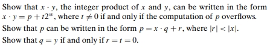

## 习题2.35

```c
int tmult_ok(int x, int y) {
    int p = x*y;
    /* Either x is zero, or dividing p by x gives y */
    return !x || p/x == y;
}
```

我们是不能用减法来判断 加法是否溢出如
```
int add_ok(int x, int y) {
    int s = x + y;
    return s - x == y && s - y == x; // 错误，总是返回true
}
```

但是乘法是可以的:



## 习题2.36

不使用除法判断乘法是否溢出，不会，答案如下：

```c
int tmult_ok(int x, int y) {
    int64_t pll = (int64_t) x * y;
    return pll == (int) pll;
}
```

## Aside Security vulnerability in the XRD library

考虑这样一条语句: `void *result = malloc(ele_cnt * ele_size)`，假设ele_cnt等于(2^20 + 1),而ele_size等于2^12，并假设系统是32bit的，那么这个malloc就会overflow。这样实际上只有1 * 2^12个字节被分配，而之后可能使用更多的空间，那么程序就有问题了。

## 习题2.37

我们将之前溢出的malloc改成如下的形式:
uint64_t asize = elecnt * (uint64_t) ele_size;
void *result = malloc(asize);

可以保证的是asize是一个正确的64位数，但是malloc接收的参数如果是32bit的，那岂不是没有意义？似乎正确的做法是先判断有无overflow，如果有直接抛出异常？

答案:声明一个size_t 的request_size， 判断request_size 与 (size_t)asize 是否相等，如果不等说明溢出了。如果返回null。


