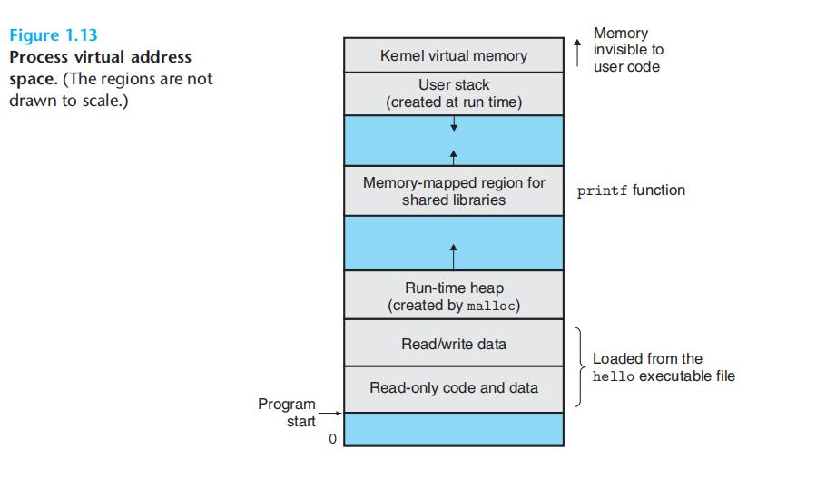
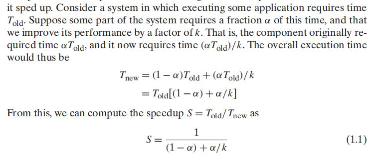
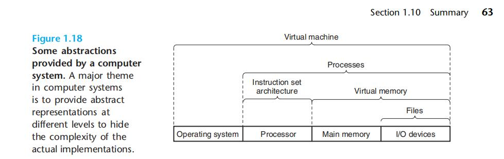

# Chapter.1 概述

--------------
### 1.7.3 虚拟内存

感觉和内存的五大区类似

如上图所示,

- 地址是向上增大的
- 程序开始在最下面
- 代码区
- 接着是C全局变量相对应的数据位置
- 运行时堆,在一开始就根据代码确定了大小,但可以通过`malloc`/`free`等进行容量变化
- 共享库用来存放C标准库和数学库一类的
- 用户栈的一个用法是函数调用
- 内核虚拟内存,内核保留区域,只能用过系统调用来尝试交互

--------------

### 1.7.4 文件

文件就是字节序列

--------------

## 1.8 系统之间利用网络通信

简而言之就是两台电脑两个shell互相复制文件和系统调用

--------------

## 1.9 重要主题

### 1.9.1 Amdahl 定律

> 当我们对系统的某个部分加速时,其对系统整体性能的影响取决于该部分的重要性和加速程度

> 结论:  
>> 如果想要显著加速整个系统,必须提升全系统中相当大的部分的速度。

### 1.9.2 并发和并行

1. 线程级并行

单核并发都是假并发,即快速在不同进程/线程之间切换

多核的出现那才是真并发

> `超线程`
>> 即允许一个CPU执行多个控制流技术  
>> 但有一个前提,即PC计数器,和寄存器等一些硬件部分必须有多个备份

比如`I7`就可以让一个核同时执行两个线程

2. 指令级并行

通过流水线的思想来加快效率

如果一个处理器可以达到比一个周期一条指令更快的执行速率,就成为`超标量`

3. 单指令、多数据并行

更低一层次,即一条指令并行执行多条操作,即SIMD并行

### 1.9.3 抽象的重要性

上面这个图表示出了从底层不断往上抽象的方式

抽象: 即隐藏底层复杂度,这个思想在编程里很实用

**三层抽象**

> 文件对I/O设备的抽象
>> 虚拟内存是主存和磁盘的抽象
>>> 进程是处理器、主存和I/O设备的抽象

--------------

# 总结

> 1. 计算机系统是由硬件和系统软件组成

> 2. `1`的共同协作来运行应用程序