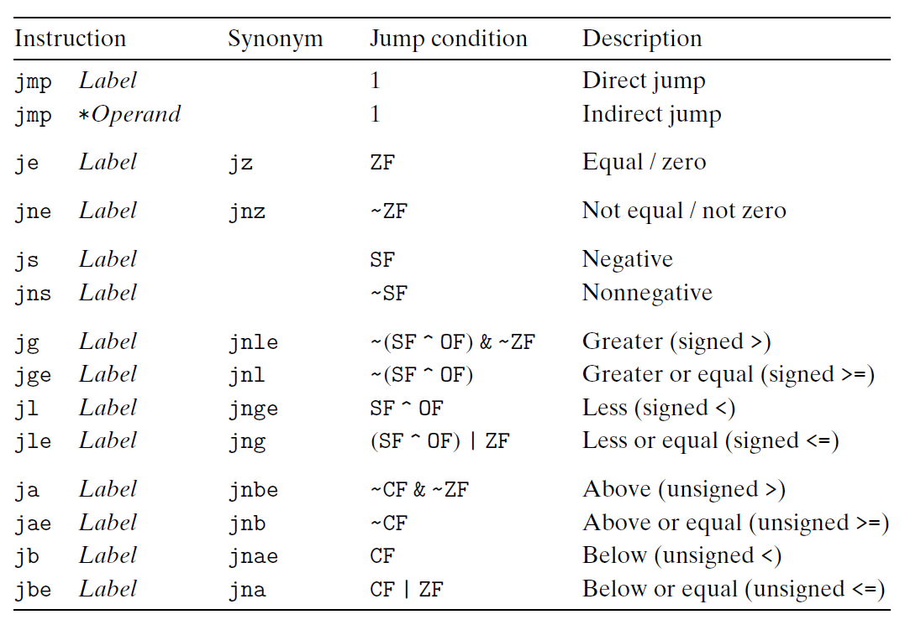

# Ch3 Machine-Level Representation of Programs

## 3.6 Control

**跳转指令**

跳转指令会切换到程序的其它位置进行执行，在汇编代码中，跳转的地址会用一个 label 来标记。

跳转指令分为：

* 无条件跳转
    * 直接跳转，通过 label 标记的位置进行跳转；
    * 间接跳转，跳转目标可以是寄存器或者内存地址；
        * `jmp *(%rax)` 
        * `jmp *%rax`
* 有条件跳转
    * 根据条件码的组合进行跳转，和 $set$ 类指令的条件组合类似；
    * 只能直接跳转。

**跳转指令的编码**

理解机器代码的跳转有助于理解反汇编器的输出。

两种常见的编码方式：

* PC 相对编码：将目标指令和跳转指令后的指令的地址差作为编码；
* 绝对地址编码：直接使用 4 字节指定目标代码。汇编器和链接器来进行地址重定位。

