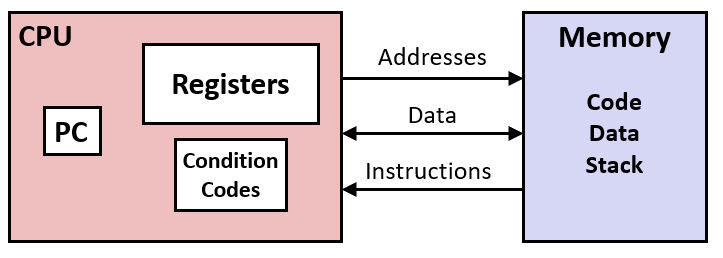
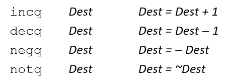

# Assembly Basics
## Assembly/Machine Code View
### Programmer-Visible State

+ PC: Program counter
  - Address of next instruction
  - Called “RIP” (x86-64)
+ Register file
  - Heavily used program data
+ Condition codes
  - Store status information about most recent arithmetic or logical operation
  - Used for conditional branching
+ Memory
  - Byte addressable array
  - Code and user data
  - Stack to support procedures

### x86-64 Integer Registers


### Moving Data
`movq Source, Dest`
**Operand Type**
|Type|description|Example|Appendix|
|--|--|--|--|
|Immediate|Constant integer data|$0x400, $-533|Encoded with 1, 2, or 4 bytes|
|Register|One of 16 integer registers|%rax, %r13|%rsp reserved for special use|
|Memory|8 consecutive bytes of memory at address given by register|(%rax)|Various other “addressing modes”|

### movq Operand Combinations


### Memory Addressing Modes

+ Normal
  - Register R specifies memory address
  - Pointer dereferencing in C `*p`
  - `movq (%rcx),%rax`
+ General 

- **D(Rb,Ri,S)	Mem[Reg[Rb]+S*Reg[Ri]+ D]**

|Character|Description|
|--|--|
|D|Constant “displacement” 1, 2, or 4 bytes|
|Rb|Base register: Any of 16 integer registers|
|Ri|Index register: Any, except for %rsp|
|S|Scale: 1, 2, 4, or 8 |

### Address Computation Examples:
|||
|--|--|
|%rdx|0xf000|
|%rcx|0xf100|

|Expression|Address Computation|Address|
|--|--|--|
|0x8(%rdx)|0xf000 + 0x8|0xf008|
|(%rdx,%rcx)|0xf000 + 0x100|0xf100|
|(%rdx,%rcx,4)|0xf000 + 4*0x100|0xf400|
|0x80(,%rdx,2)|2*0xf000 + 0x80|0x1e080|

## Address Computation Instruction
`leaq Src, Dst`
+ Src is adress mode expression
+ Set Dst to address denoted by expression

### Uses
+ Computing addresses without a memory reference
+ E.g., translation of `p = &x[i];`
+ Computing arithmetic expressions of the form
+  `x + k*y`  (k = 1, 2, 4, or 8)
### For Example:
```C
// C
long m12(long x)
{
  return x*12;
}
```
```ASM
// ASM
leaq (%rdi,%rdi,2), %rax  # t = x+2*x
salq $2, %rax             # return t<<2
```

## Some Arithmetic Operations
### Two Operand Instructions:

+ No distinction between signed and unsigned int
### One Operand Instructions:


## Turning C into Object Code
+ Code in files  p1.c p2.c
+ Compile with command: `gcc –Og p1.c p2.c -o p`
  - Use basic optimizations (-Og) [New to recent versions of GCC]
  - Put resulting binary in file p


使用不同版本的gcc编译器会生成不同的ASM语句

以.开头看起来很奇怪的语句通常是指令