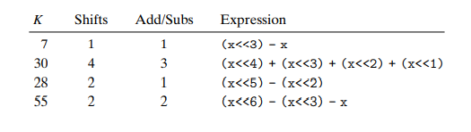

## 2.3.6 Multiplying by Constants

乘法可以考虑通过左移(2^n)再叠加方法，这样可能会减少一些cycles。

## 习题 2.38

LEA指令 可以看作: `(a<<k)+b`,k可以是0-3里面的任意数，如果b等于0的话，那么k可以取的值是`2^k`，而等于a的话，乘法值可以取`2^k + 1`(参考答案)。

## 习题 2.40

| K   | shifts | Add/Sub | Expression               |
| --- | ------ | ------- | ---------                |
| 7   |    1   |    1    | (x << 8) - x             |
| 30  |    4   |    3    | (x << 16) + (x << 8) + (x << 4) + (x << 2) |
| 28  |    2   |    1    | (x << 32) - (x << 4)     |
| 55  |    2   |    2    | (x << 64) - (x << 8) - x |

答案：
K这里指的是结果多少倍，而不是如何分解qaq..

## 习题 2.41

从bit n 到 bit m (n >=m) 有两种方式，编译器应该使用的是operations最少的那种。

## 2.3.7 Dividing by powers of 2

对于补码而言，要先添加当前值的bias，从而使得结果朝0进位。

## 习题2.42

实现div16:

正数不变，负数补15?

`(x + (15 & (x & (1 << 31) >> 31))) >> 4`

## 习题2.43

寻找M,N的正确值，M应为31, N应为8
