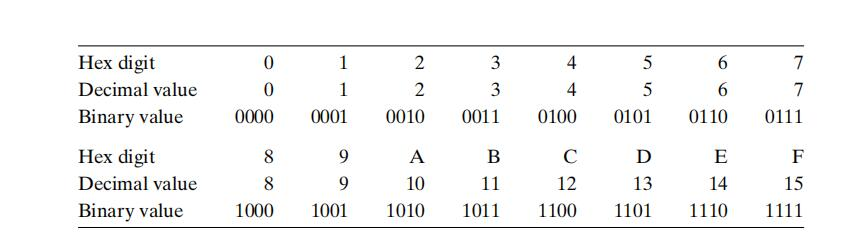
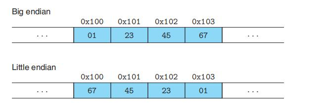

# Chapter.2

--------------
## 2.1
### 2.1.1 十六进制表示法

1. 十进制与位模式转换十分麻烦,所以一般用十六进制来替代

十六进制和二进制的转换可以直接由打表法进行

  

给一个`0xFa1D37b`,转二进制时直接根据上表对位填充即可

2. `2^n`用十六进制表示

- 二进制实际就是`1`后面跟了`n`个0
- n表示成`i+4j`的形式,对应的十六进制就是`0x(2^i)000(j个0)`

比如 `2^11=2048`  
我们有 n = `3+4*2`  

2^3 = 8

表示为十六进制就是: 0x800(2个0)

--------------


### 2.1.2 字数据大小

字数据大小是由机器的字长决定的,比如32位/64位

c语言中变量所占字节大小也可能因为硬件的不同而不同,比如`long`在32位是4字节,在64位是8字节

C99引入了定长的数据类型,不管在什么架构都占相同的字节,`int32_t`和`int64_t`

**程序员应该力图使他们的程序在不同的机器和编译器上可移植**

> 举个栗子,如果一个程序员用int尝试存储一个指针,32位机器上可能可以运行,但是64位就一定会出错

--------------

### 2.1.3 寻址和字节顺序

> 大端和小端
>> 这个主要是和机器如何存储数据有关  
>> 是按照地址低的在前面还是地址高的在前面决定是大端还是小端存储



这个问题可能会出现网络传输中,如果不同类型的计算机传递数据时,可能会发现字节变成了反序.为了避免这个问题,发送前必须先将数据转换为网络通用格式,再由本地解析.

> **打印对象的字节表示(可以用来判断是大端还是小端)**

```cpp
#include<bits/stdc++.h>

typedef unsigned char *byte_pointer;


void show_bytes(byte_pointer start,size_t len){
    size_t i;
    for(i = 0;i<len;++i){
        printf("%.2x ",start[i]);
    }
    printf("\n");
}

void show_int(int x){
    show_bytes((byte_pointer) &x,sizeof(int));
}

void show_float(float x){
    show_bytes((byte_pointer) &x,sizeof(float));
}

void show_pointer(void *x){
    show_bytes((byte_pointer) &x,sizeof(void*));
}

int main(){

    int val = 10;

    int ival = val;
    float fval = (float)ival;
    int *pval = &ival;
    show_int(ival);
    show_float(fval);
    show_pointer(pval);

    return 0;
}

```

- Linux32 Windows Linux64 都是小端
- Sun 是大端


--------------

### 2.1.5 代码的编码表示

代码编码成二进制后不同平台生成的二进制代码差别可能会很大.这不同于常量或者变量,后者不会产生过大的差别,而前者的差别主要由操作系统决定


--------------

### 2.1.9 移位运算

左移右移如果越界会丢弃最高/低位然后补0

但是如果移动的位数很大,可能会按照 k(移动多少位)%w(实际位) 来决定实际移动多少位

> **加法运算符优先级比移位高**

比如 1<<2+3<<4 等价于 1<<(2+3)<<4
