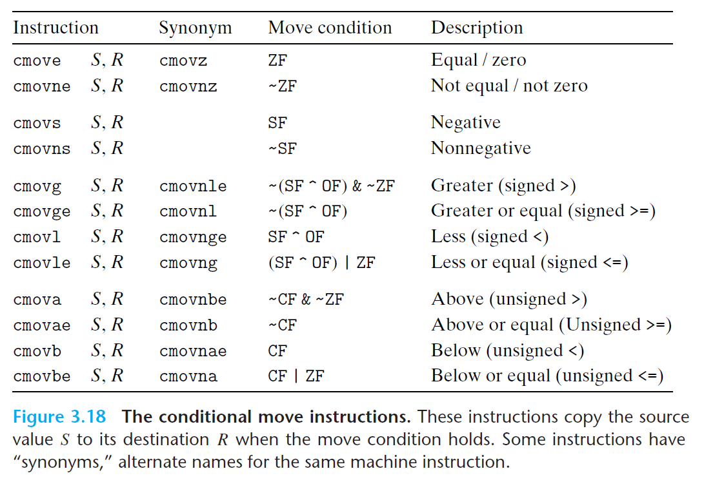
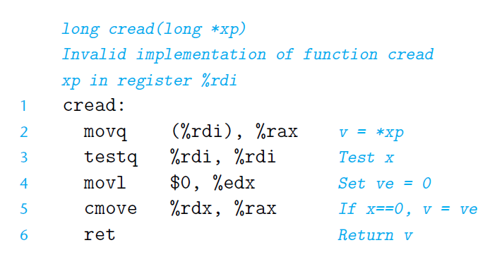

# Ch3 Machine-Level Representation of Programs

## 3.6 Control

**用条件控制来实现条件转移**

C 中 if - else 到汇编代码的条件转移。

**用条件传送来实现条件转移**

使用条件数据的条件转移，计算条件分支的两种操作结果，最后根据条件来从两个结果中选择。

这种优化策略仅在某些受限条件下可行，如可行，仅用**条件传送指令**即可实现。

为什么这种方式更优：

* 现代 CPU 使用流水线来提高性能，将 CPU 执行周期（取址、译码、运算 ....）重叠交织在一起；例如，在取址的同时执行运算；
* 要实现上述优化，需要能实现确定要执行的指令序列，保证流水线中充满待执行的指令；
* 但是，当遇到条件分支的时候，CPU 需要进行分支预测来猜测走哪个分支；
    * 如果猜中；能继续保持流水线充满；
    * 否则发生了流水线冒险，需要从正确位置重新填充流水线，浪费 CPU 时钟周期，导致程序性能下降；

下图为一些**条件传送指令**：

* 条件传送指令和 $set$ 和 $jmp$ 类指令类似，指令的结果取决于条件码的值；仅当满足条件时，源值才会被拷贝到目的寄存器中；
* 条件传送指令支持 16 位，32位，64位的操作数，不支持单字节的条件传送；
* 不像某些将操作长度显示编码在汇编指令名中，汇编器能从目标寄存器中推断出条件传送指令的操作数长度，因此，对于不同长度的操作数，可以使用同一个指令名；
* 条件传送指令仅仅检查条件码，根据条件去更新目的寄存器；不执行某些测试。

书中列举了一个不能用条件传送来编译的条件表达式：

其错误在于，第二行将指针解引用，但是这个指针很有可能是个空指针，这样直接导致错误行为。这种情况下，只能使用条件分支。

此外，条件传送并不一定高效，这取决于条件分支预测出错浪费的性能和条件传送的两个条件的计算消耗，需要进行权衡，但是 CPU 根本没有足够的信息和时间去决策两种方式的优劣，因此，

* 在简单情况下，才使用条件传送回；
* 即使分支预测出错浪费的时间周期大于复杂计算的时间周期，编译器也倾向于选择条件分支。

