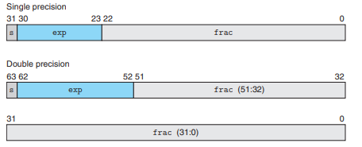

## 2.4.2 IEEE FLoating-Point Representation

`V=(-1)^S x M x 2^E`是IEEE的标准浮点表达式

- 对于数值0而言，需要特殊对待
- exponent E是一个指数值
- significand M是fractional binary表示一个0-1或1-2的小数

分为三种：
- normalized e为非全0非全1 此时M = f + 1
- denormalized e为全0
- special e为全1

## 习题 2.47

| Bits    |   e   |   E   |   2^E |   f   |   M   | 2^E * M   | 
| ------- | ----  | ----- | ----  | ----- | ----- | -------   | 
| 0 00 00 |   0   |   -3  |   1/8   | 0  |   0   |     0     |  
| 0 01 10 |   1   |   -3  |   1/8 |  2/4   | 6/4 | 3/16      |  
| 0 10 00 |   2   |   -2  |   1/4 |  0   | 4/4 | 1/4 |
| 0 10 11 |   2   |   -2  |   1/4 | 3/4  | 7/4  | 7/16 |
| 0 11 00 |       |       |       |      |      |   infinity |
| 0 11 11 |       |       |       |      |      |   NAN     |
(错误) 
正确的bias应该是2^(k - 1)

| Bits    |   e   |   E   |   2^E |   f   |   M   | 2^E * M   | 
| ------- | ----  | ----- | ----  | ----- | ----- | -------   | 
| 0 00 00 |   0   |   0  |   1   | 0  |   0   |     0     |  
| 0 01 10 |   1   |   0   |   1 |  2/4   | 6/4 | 3/2      |  
| 0 10 00 |   2   |   1  |   2 |  0   | 4/4 | 2 |
| 0 10 11 |   2   |   1  |   2 | 3/4  | 7/4  | 7/2 |
| 0 11 00 |       |       |       |      |      |   infinity |
| 0 11 11 |       |       |       |      |      |   NAN     |

浮点数能表达的数很大，float大约可以表达2^127 double则有2^1023,但是越大的精度越差

