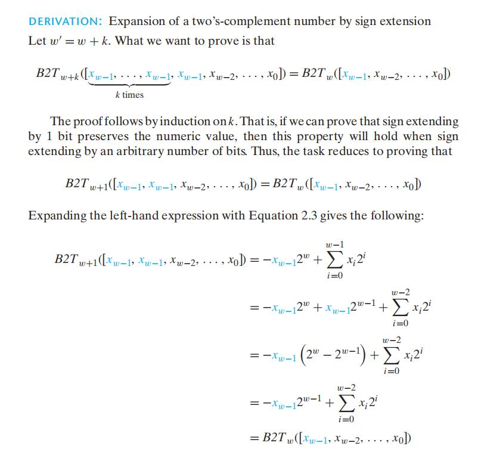

# Chapter.2

--------------
## 2.2

### 2.2.5 C语言中的有符号数与无符号数

C语言在执行运算的时候,如果一个是有符号,一个是无符号,C语言会**隐式的把有符号转成无符号**,所以,在使用`>` `<` 这类运算符时,就有可能会出错


--------------

### 2.2.6 扩展一个数字的位的表示

上面说到,运算时会产生强转,而强转就有可能会导致运算出错,比如下列代码,明显出错了

```cpp
#include<bits/stdc++.h>
using namespace std;

short sx = -12345;
unsigned int sq = 2;
unsigned int sp = sx;

int main(){
    cout<<sq+sx<<"  转型后的sx:  "<<sp<<endl;
    return 0;
}

//**
//输出 4294954953  转型后的sx:  4294954951
//

```

扩展数字的位的意思是: `当一个数向高位转型时,多出的部分该以什么方式进行拓展`

> 无符号整型拓展 **零拓展**
>> 意思就是得到低位的二进制后,向上转型时向前填充`0`

> 补码的符号拓展 **符号位向前补充**
>> 比如符号位是`1`,就一直向前补充`1`,`0`一样,下面是证明就算拓展`1`仍然数值仍然会保持不变




--------------

### 2.2.7 截断数字(向下转型)

> 大意就是向下转型会把多余的位砍掉从而导致数值溢出

--------------


> Latex转Svg

https://www.latexlive.com/