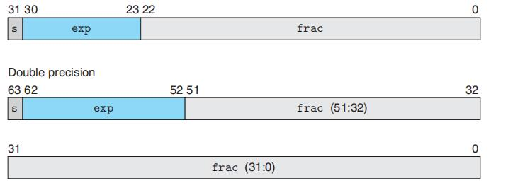

# Chapter.2

--------------
## 2.3 整数运算

> 补码的非
>> 如果是索取范围的最小值 ,非就等于最小值,否则非的结果就是 `-1 * N`

> 无符号乘法
>> 溢出的话按照 `取余最大值` 作为结果

> 乘法往往需要花费十个时钟周期,而其他(加减,位移)都只需要一个时钟周期
>> 所以编译器尝尝把`乘以常数`的乘法尝试替换成加减,或者移位的算法

--------------

## 2.4 浮点数

举个栗子

123.45 = 1.2345 * 10^2

- 尾数: 1.2345
- 基数: 10
- 指数: 2

在基数为2的情况下:

对于浮点数而言,第一位都是`符号位`,第二段则是指数位(`阶码`,**负数,需要加上偏移量**,这部分是移码表示,为了表达负数而设计的),第三段是小数部分(`尾数`,**小数点后的值**)

所以我们需要求的就是阶码,尾数

有两种求法,一种是类似于CPU运算方式的求法,一种是数学求法

###  数学求法

比如 `0.085`

0.085 = 1.36*2^(-4)  (按十进制算)

那么符号位就是`0`  
指数位就是 `-4+127=123` 的二进制  
小数位就是 `0.36` 的二进制表示  

小数位的求法:  

`.000000` 对于二进制小数而言,转十进制,第一位是0.5,第二位是0.25....这样无穷无尽的加

所以结果就是:  

0 01111011 01011100001010001111011    

### 拟CPU运算

39.29

- 39的二进制表示(100111)
- 0.29的二进制表示(.01001010...)
    - 这一步可以反复乘2法来做(也可以用上面说的数学方法来做)
    - 如果小于1,补0继续乘2
    - 如果大于1,补1并只保留小数位
    - 直到值等于1
    - 所以是无穷小数
- 得到: 100111.01001010...
- 转成二进制科学计数法: 1.0011101001010... * 2^5
- 得到
    - 符号位: 0
    - 阶码: 5+127=132 的二进制
    - 尾数: 0011101001010...

**浮点数运算通常不具备结合性**

--------------

> Latex转Svg

https://www.latexlive.com/