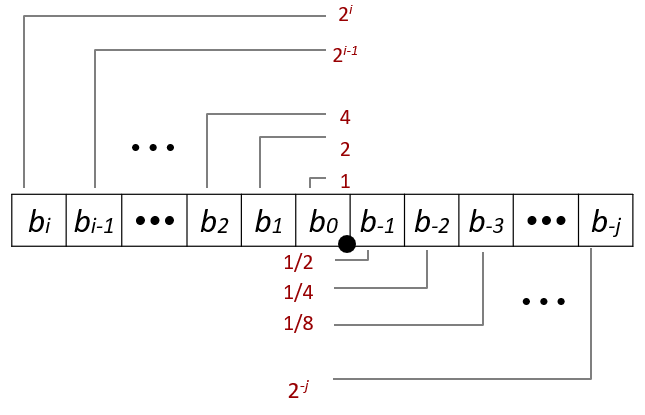

# Floating Point
## Fractional Binary Numbers

+ Representation
  - Bits to right of “binary point” represent fractional powers of 2
  - Represents rational number: $\sum_{k=-j}^i b_k \times 2^k$

## Representable Numbers
+ Limitation #1
  - Can only exactly represent numbers of the form x/2k
  - Other rational numbers have repeating bit representations

|Value|Representation|
|--|:--|
|1/3|0.0101010101[01]…2|
|1/5|0.001100110011[0011]…2|
|1/10|0.0001100110011[0011]…2|

**PS 十进制小数转二进制：将小数位不断x2，若整数位为1则舍弃并设置该位为1，否则为0，直到小数部分为0**

+ Limitation #2
  - Just one setting of binary point within the w bits
  - Limited range of numbers

## IEEE Floating Point
### IEEE Standard 754
+ Established in 1985 as uniform standard for floating point arithmetic
  - Before that, many idiosyncratic formats
+ Supported by all major CPUs
### Driven by numerical concerns
+ Nice standards for rounding, overflow, underflow
+ Hard to make fast in hardware
  - Numerical analysts predominated over hardware designers in defining standard
