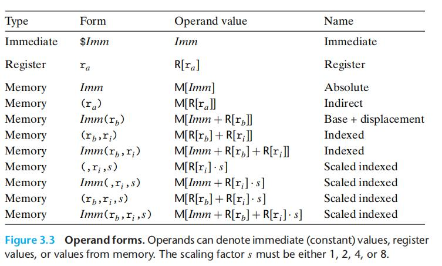

# Chapter.3 程序的机器级表示

--------------

## 3.3 数据格式

由于是从16位体系结构拓展成32位的,Intel用术语"字"表示16位数据类型,32位是"双字",64位是"四字"

指针一般是8字

下面是常见的字节类型

| C声明        | Intel数据类型    |  汇编代码后缀  | 大小(字节) |
| --------   | -----:    | :----: |:----:|
| char       | 字节      |   b    | 1   |
| short      | 字        |   w    | 2   |
| int        | 双字      |   l    | 4   |
| long        | 四字      |   q    | 8   |
| char*        | 四字      |   q    | 8   |
| float        | 单精度      |   s    | 4   |
| double        | 双精度      |   l    | 8  |


`double`和`int`用的都是`l`,这不会产生歧义,因为浮点运算和整形运算是在完全不同的指令和寄存器上的.

数据传输的指令:

```
movb
movw
movl
movq
```

--------------

## 3.4 访问信息

### 3.4.1 操作数指示符

大多数指令有一个或者多个`操作数`

- **立即数**: 用来表示常数值,写法一般是`${数值}`
- **寄存器**: 用`r_a`表示寄存器,用引用`R[r_a]`表示值
- **内存引用**: 将内存看成一个很大的字节数组,用符号`M_b[Addr]`表示对存储在内存中从`Addr`开始的`b`个字节值得引用

常见寻址方式:



--------------


> Latex转Svg

https://www.latexlive.com/