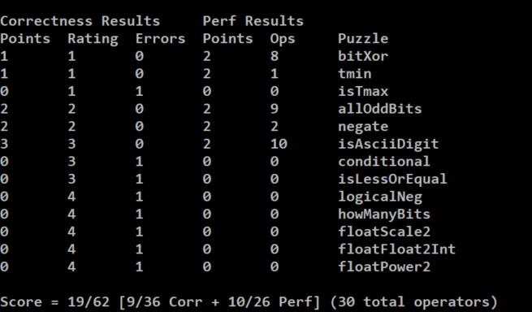

# datalab

目前完成了前6个，有一个还有问题



详细代码见`bits.c`

```c
int bitXor(int x, int y) {
	return ~((~((~x) & y)) & (~(x & (~y))));
}

int tmin(void) {
	return 1 << 31;
}

//TODO: 不用左移
int isTmax(int x) {
	int maxval = 0x7f;
	maxval = (maxval << 8) + 0xff;
	maxval = (maxval << 8) + 0xff;
	maxval = (maxval << 8) + 0xff;
	return !(x ^ maxval);
}

int allOddBits(int x) {
	int maxval = 0xAA;
	maxval = (maxval << 8) | 0xAA;
	maxval = (maxval << 8) | 0xAA;
	maxval = (maxval << 8) | 0xAA;
	return !((x & maxval) ^ maxval);
}

int negate(int x) {
	return (~x) + 1;
}

int isAsciiDigit(int x) {
	return !(x ^ 0x39) | !(x ^ 0x38) | !((x & (~7)) ^ 0x30);
}

```
