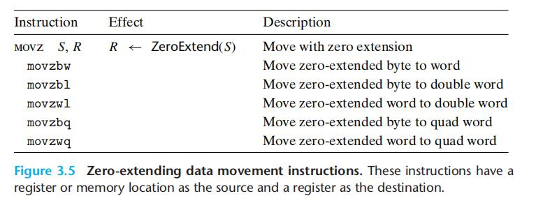
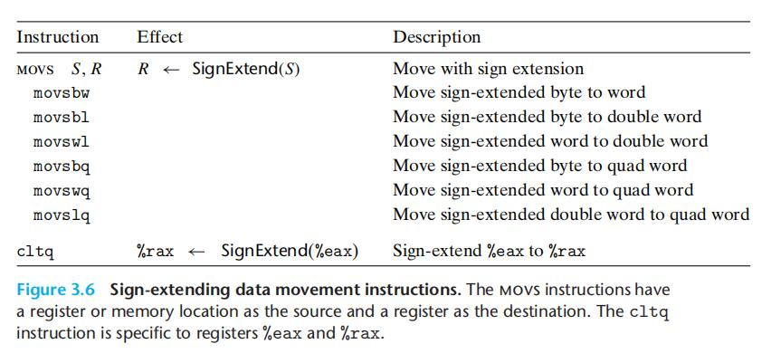
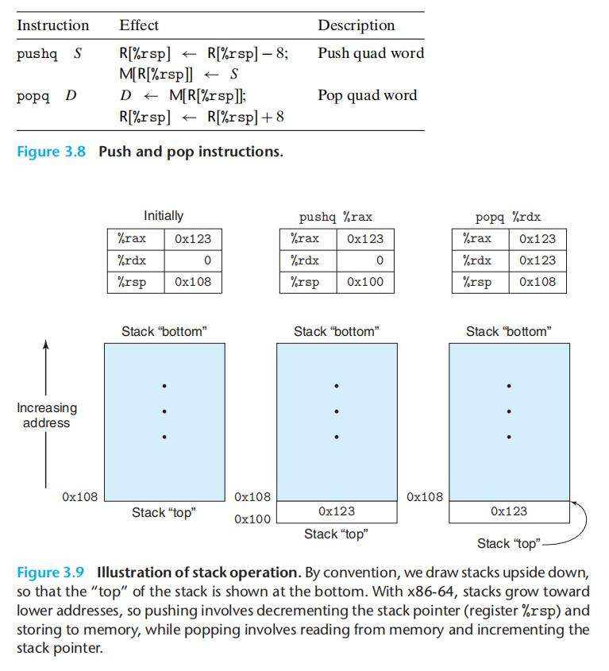

# Chapter.3 程序的机器级表示

--------------

## 3.4.2 数据传送方式

主要是负责数据的传输,根据源和目的不同,执行的转换不同,或者副作用不同,可以分为不同的`指令类`  

- 最简单的传送指令类,`MOV类`

**源操作数**: 指定的值是一个立即数,存储在寄存器中或者内存中  
**目的操作数**: 指定一个位置,要么是一个寄存器,要么是一个内存地址  
x86-64加了一个限制,即两个操作数不能都指向内存位置

目的操作数必须和指令的最后一个字符('b','w','l','q')指定的大小匹配

```
movl $0x4050,%eax   立即数-寄存器,4字节
movw %bp,%sp        寄存器-寄存器,2字节
movb (%rdi,%rcx),%al 内存-寄存器,1字节
movb $-17,(%rsp)    立即数-内存,1字节
movq %rax,-12(%rbq) 寄存器-内存,8字节
```

`movabsq`指令能够以任意64位立即数作为源操作数,只能以寄存器作为目的

- 做`零扩展`的`MOVZ类`

将剩余字节填充0



- 做`符号拓展`的`MOVS类`

将源操作数最高位复制



`cltq`指令只作用于寄存器%eax和%rax

--------------

## 3.4.3 数据传送示例

```cpp
long exchange(long *xp,long y){
    long x = *xp;
    *xp = y;
    return x;
}
```

汇编

```
exchange:
    movq (%rdi),%rax
    movq %rsi,(rdi)
    ret
```

> 函数通过把值放在`rax`或该寄存器的某个低位中返回

指针的实现方式就是 `间接寻址`  即:  (%rdi)


--------------

## 3.4.4 压入和弹出栈数据



栈是向下增长的,它被存放在内存的某个区域内

`%rsp`保存着栈顶元素的地址

--------------


> Latex转Svg

https://www.latexlive.com/