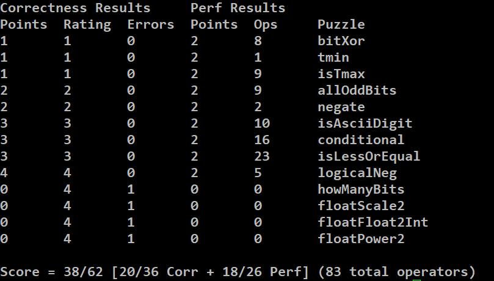

# datalab

完成了前9个，并且把昨天有问题的一个测试修复了。感觉写后面的比较吃力，尝试写了第10个，没有想到满足条件的办法，
看了看网上其他的答案，感觉过于tricky加上自身能力有限，决定这个lab就做到这里QAQ。




判断最大值(0x7fffffff)可以判断((x + 1) ^ x) 是否等于 0xffffffff，对于0xffffffff本身需要单独判断一下，
昨天用了一种复杂的mask的方式，但是由于题目要求mask只能为8个bit，所以需要若干次左移求和操作，导致操作数太多。

```
int isTmax(int x) {
      return !(!(x + 1)) & !(((x + 1) ^ x) ^ ~0);
}
```

判断是否是'0'-'9',观察到'0'-'9是0x30-0x39，可以看作是0x30-0x37 与0x38,0x39,因为0x30到0x37是满足最低3位的全排列,
然后特殊判断0x38, 0x39。

```
int isAsciiDigit(int x) {
      return !(x ^ 0x39) | !(x ^ 0x38) | !((x & (~7)) ^ 0x30);
}
```

用了一种比较复杂的方法，如果构造cond = 0x00000000/0xffffffff，分别对z和y进行与运算和求反再与运算，
这样最后要么是z，要么是y

```
int conditional(int x, int y, int z) {
      int cond = !(x ^ 0);
      cond = (cond << 1) + cond;
      cond = (cond << 2) + cond;
      cond = (cond << 4) + cond;
      cond = (cond << 8) + cond;
      cond = (cond << 16) + cond;
      return (cond & z) + ((~cond) & y);
}
```

分几种情况，

x负，y正，判断符号位即可，`((!(xsign) & (ysign))`

相等的时候: `!(v ^ 0)`

x正，y负，则不可能,对应`(!((xsign) & (!(ysign)))`

其余情况 `!(v & (1 << 31)))`

```
int isLessOrEqual(int x, int y) {
      int v = x + ((~y) + 1);
      int xsign = !(x & (1 << 31));
      int ysign = !(y & (1 << 31));
      return ((!(xsign) & (ysign)) | !(v ^ 0) | !(!(v & (1 << 31)))) & (!((xsign) & (!(ysign))));
}
```

实现`!`，通过构造最高位的不同情况实现
```
int logicalNeg(int x) {
      return (((x|((~x) + 1))) >> 31) + 1;
}
```


