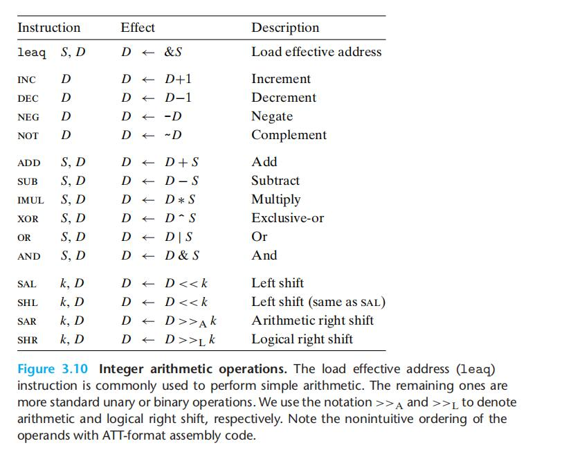

# Chapter.3 程序的机器级表示

--------------

## 3.5 算数和逻辑操作



上土市x86下的一些整数运算操作  
一般是S运算与D寄存器内进行一些操作

--------------

## 3.5.1 加载有效地址

`leaq`实际上是`movq`指令的变形

`leaq` 既可以表示指针,也可以给寄存器直接赋值

比如:

```cpp
long scale(long x,long y,long z){
    long t = x+4*y+12*z;
    return t;
}
```

编译成汇编:

```
scale:
    leaq (%rdi,%rsi,4),%rax     x+4*y
    leaq (%rdx,%rdx,2),%rdx     z+2*z = 3z
    leaq (%rax,%rdx,4),%rax     (x+4*y) + 4*(3*z) 
    ret
```

上面的运算遵循前面 `操作数指示符` 那章的`操作数格式`  

--------------

## 3.5.2 一元和二元操作

`INC、DEC、NEG、NOT` 这四个操作符是一元操作,类似于 `++` 和 `--`

`ADD、SUB...`这一系列指令(见最上面的表),是二元操作  

第一个是源操作数,第二个是目的操作数  
第一个: 立即数、寄存器、内存位置  
第二个: 寄存器、内存位置

**如果第二个是内存地址的话 ,处理器就必须从内存中读出值,进行操作,再把结果写进内存**

## 乘法

`imulq 和 mulq`: 有第二种用法,就是单操作数,单操作数的时候,直接对返回值寄存器`%rax`进行操作


--------------


> Latex转Svg

https://www.latexlive.com/