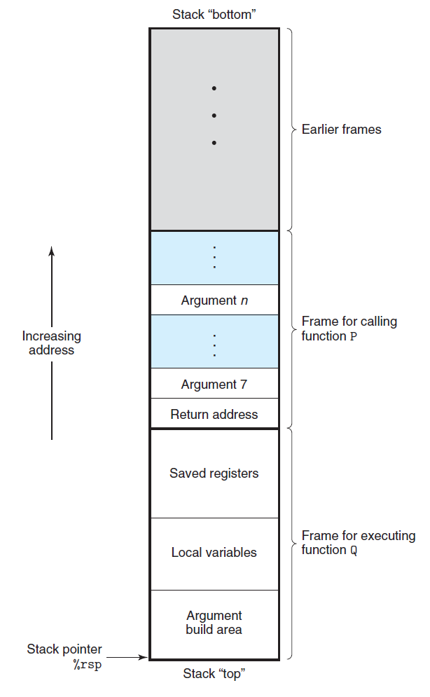

# Ch3 Machine-Level Representation of Programs

## 3.7 Procedures

过程提供了代码封装的方式，用指定的参数和返回值实现了程序功能。好的程序使用过程作为作为抽象机制，隐藏某个行为的具体实现，同时提供简洁清晰的接口定义。

机器级别上要支持过程的运行，例如过程 P 调用过程 Q，Q 执行完成后返回，需要包括下面三个机制：

1. 传递控制；控制流如何转移？
2. 传递数据；函数调用参数如何传递？
3. 分配和释放内存；如何分配调用过程所需的局部变量空间？

**运行时栈**

x86-64 的栈地址向低地址方向增长， 栈指针 `%rsp` 指向栈顶元素，用 $pushq$ 或者 $popq$ 将数据放入栈中或者是取出数据。

当 x86-64 过程需要的存储空间超出寄存器能存放的大小时，就会在栈上分别空间，这部分内存是过程的栈帧（stack frame）。

过程 P 调用 Q 的步骤如下：

1. 返回地址入栈，这个函数地址属于过程 P 的栈帧；
2. 过程 Q 请求分配其栈帧所需的内存空间，扩展栈顶；
3. 在栈帧中保存寄存器的值，分配局部变量空间，为调用过程设置参数等。

此外，以下几点值得注意：

* 大多数过程的栈帧都是定长的，在过程开始的时候就分配好；但也存在变长的栈帧；
* 过程仅能通过寄存器传递最多 6 个整数值（即指针和整数类型）；如果有更多参数，需要在 P 调用 Q之前在 P 的栈帧中存储参数；
* 如果能通过寄存器传递的话，图中的栈帧中的某些部分可以省略；此外，有一些函数不需要栈帧。

