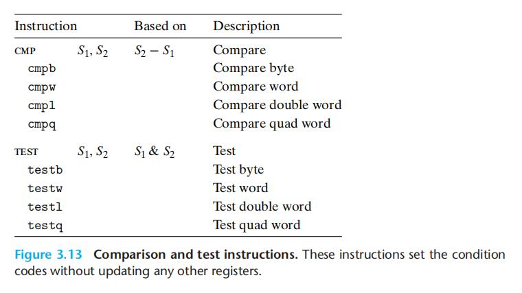
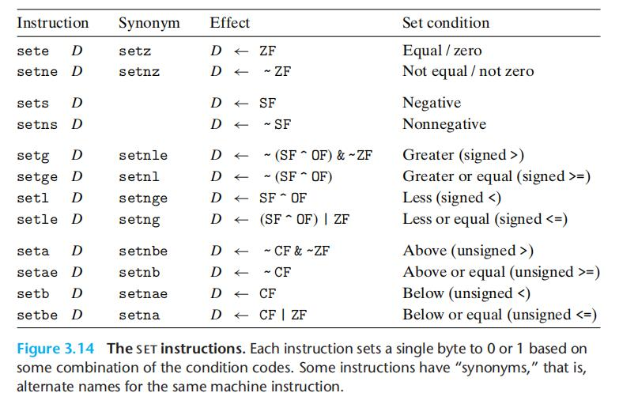
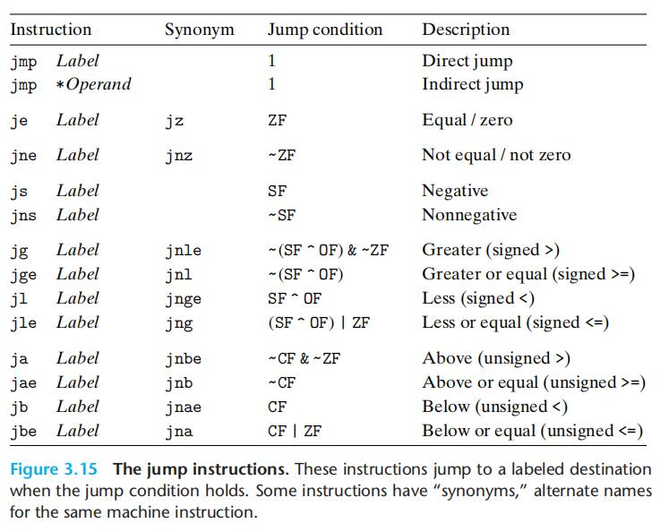

# Chapter.3 程序的机器级表示

--------------

## 3.6 控制

即if/while/switch等等

### 3.6.1 条件码

除了整数寄存器,CPU还维护着一组单字节的`条件码`寄存器,**它们描述了最近逻辑或算术操作的属性,可以通过检测这些寄存器来执行分支指令**

常见的条件码有:  

`CF`: 进位标志,可以用来检查符号位是否溢出,`最近的`操作触发了进位  
`ZF`: 零标志,`最近的`操作得出的结果是`0`  
`SF`: 符号标志,`最近的`操作得到的结果是负数  
`OF`: 溢出标志,`最近的`操作导致一个补码溢出--正溢出或反溢出

前前一篇笔记有一个指令的图,那个图中除了`leaq`其他都会设置标记位,`leaq`只做地址运算,其他的不做

有些操作不可能会导致部分条件码改变  
比如`XOR`,进位标志和溢出标志就一定不会触发,会被设置为`0`  
移位操作,进位标志将设置为最后一个被移出的位

> cmp指令和test指令
>> cmp指令对条件码的影响和SUB一样  cmp  %(a) %(b)   是比较 b:a
>> TEST和AND一样(检测是正是负之类的)  



--------------

### 3.6.2 访问条件码

条件码使用方式:  

- 1. 可以根据条件码的某种组合,将一个字节设置为0或1
- 2. 可以条件跳转到程序的某个其他部分
- 3. 可以有条件的传送数据

被称之为`SET`



set指令后面的`b/l`代表的是一种操作组合类型

比如: `sete` 就会在`equal`时设置


--------------

### 3.6.3 跳转指令

jump指令跳转到目标标号的位置继续执行指令

比如:  

```
    movq $0,%rax
    jump .L1
    movq (%rax),%rdx
.L1:
    popq %rdx
```  



--------------

### 3.6.4 跳转指令的编码

由PC直接进行跳转

--------------


> Latex转Svg

https://www.latexlive.com/