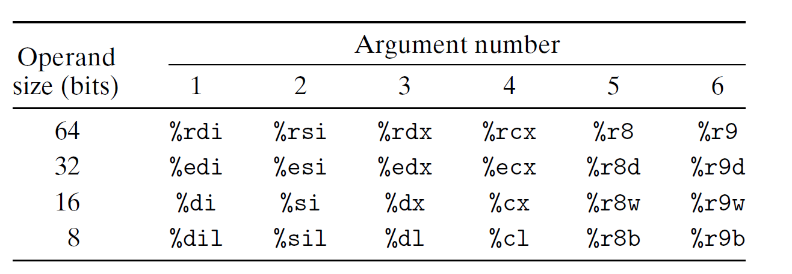

# Ch3 Machine-Level Representation of Programs

## 3.7 Procedures

**转移控制**

函数 P 调用函数 Q 时，调用结束后，需要更改 PC 寄存器为 P 要继续执行的代码位置。

x86-64 机器中，使用 $call$  指令来记录，$call$ 指令会把返回地址压入栈中，并将 PC 寄存器设置为 Q 的起始地址。

**数据传送**

x86-64 中，函数参数在大部分情况下是通过寄存器来传递的。

最多通过寄存器来传递 6 个整形（整数和指针）参数，寄存器的使用顺序如下图所示：

超出了 6 个整形参数的部分需要通过栈来传递，例如存在 n 个整形参数：

* 参数 1 - 6 将复制到对应的寄存器；
* 参数 7 - n 将放到栈上：
    * 参数 7 位于栈顶；
    * 所有通过栈传递的参数，数据大小都向 8 的整数倍对齐。

