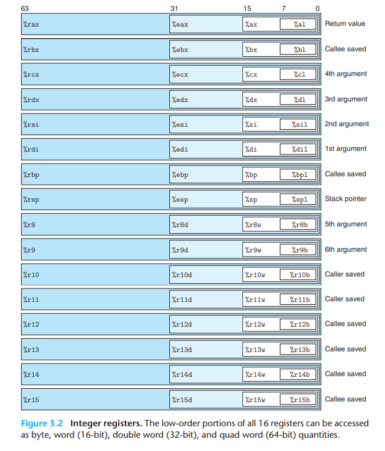
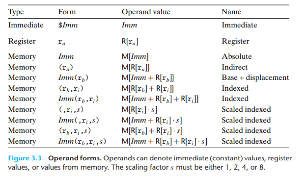
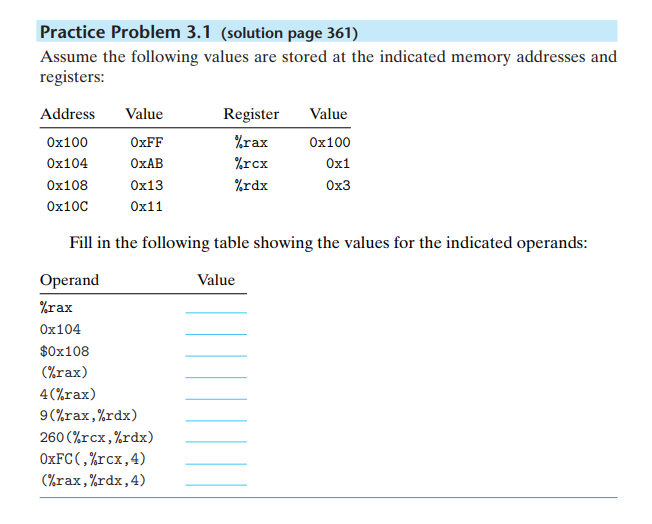

## 3.4 Accessing Information

x86-64下有16个64位的通用寄存器，并且向后兼容32位以及16位系统。

一般而言，约定的返回值是存在%rax, %rsp 是当前的stack pointer，%rbp 是栈帧的其实位置, 传参的时候前两个参数是 %rdi 和 %rsi。

## 3.4.1 Operand Specifiers

x86提供了丰富的寻址方式，这些寻址方式在访问一些数组元素的时候是很有帮助的。

## 习题3.1

我的解答：
| Value | 正确答案  |
| --------- |  --------- |
| 0x100 | |
| 0x104 | 0XAB |
| 0x13  | 0x108 |
| 0xFF  ||
| 0xAB  ||
| 0x11 ||
| 0x13 ||
| 0xAB | 0xFF |
| ?    | 0x11 , 这个应该是 memory[rax + rdx * 4] 而不是 memory[rax + rdx + 4] |

## Data Movement Instructions

最基础的如`movb`, `movw`, `movl`, `movq`，不过x86架构有一个约束move的源地址和目标地址不能同时都是memory，可以一个memory另一个是register。

从一个地址拷贝value到另一个地址需要两次操作，第一次是memory->reg,第二次是reg->memory。

> 一个很细节的东西是movl不仅仅会改变低的4字节，也会改变高的4字节至0，而movw, movb 会保持高字节为原样，

