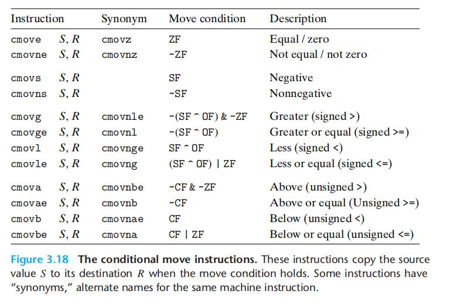

# Chapter.3 程序的机器级表示

--------------

## 3.6 控制

### 3.6.5 用条件控制来实现条件分支

> if 的汇编写法

```cpp
long lt_cnt = 0;
long ge_cnt = 0;

long absdiff_se(long x,long y){
    long result;
    if(x<y){
        lt_cnt++;
        result = y - x;
    }else{
        ge_cnt++;
        result = x - y;
    }
    return result;
}
```

他等价于下面的C代码

```cpp
long gotodiff_se(long x,long y){
    long result;
    if(x>=y){
        goto x_ge_y;
    }
    lt_cnt++;
    result = y-x;
    return result;
x_ge_y:
    ge_cnt++;
    result = x-y;
    return result;
}
```

> 等价的汇编(可以发现汇编和上面第二个c代码很接近)
>> 这就是if/else的通用模板

```
x in %rdi,y in %rsi
absdiff_se:
    cmpq    %rsi,%rdi   比较x:y
    jge     .L2         if >= goto x_ge_y
    addq    $1,lt_cnt(%rip)     全局变量lt_cnt++
    movq    %rsi,%rax
    subq    %rdi,%rax   结果放到rax返回值中
    ret
.L2:
    addq    $1,ge_cnt(%rip)     全局变量ge_cnt++
    movq    %rdi,%rax
    subq    %rsi,%rax   结果放到rax返回值中
    ret
```

--------------

### 3.6.5 用条件传送来实现条件分支

上述方法是传统方法,一条路径如果不通,就换另一种路径继续前进.`但是这种方式在处理器上是非常低效的`

一种替代的策略就是数据的条件转移,这种方式是计算条件操作的两种结果,然后根据条件是否满足选择其中一个

`只有在一些受限制的情况中,这种策略才可行`


```cpp

long absdiff(long x,long y){
    long result;
    if(x<y){
        result = y - x;
    }else{
        result = x - y;
    }
    return result;
}
```

他等价于下面的C代码

```cpp
long gotodiff_se(long x,long y){
    long rval = y-x;
    long eval = x-y;
    long ntest = x >= y;
    if(ntest) rval = eval;
    return rval;
}
```

> 等价的汇编

```
x in %rdi,y in %rsi
absdiff_se:
    movq    %rsi,%rax
    subq    %rdi,%rax   rval = x-y
    movq    %rdi,%rdx
    subq    %rsi,%rdx   eval = x-y
    cmpq    %rsi,%rdi   比较x:y
    cmovge %rdx,%rax    如果 >= rval = eval
    ret                 return rval(这个时候rval就是结果)
```


**为什么这样做能够加快运行速度呢**

后面会讲到CPU的流水线,**因为CPU是基于流水线的,但是流水线只有在确定指令顺序时才能高效运作,所以Goto其实是破坏了这个顺序,导致无法高效运作**

另外,**执行分支跳转时,是猜测跳转指令是否执行,一般来说猜测都很准确90%,但一旦猜测错误,就会导致严重的性能惩罚,但只要它猜测成功,就会使`流水线`中充满指令**

分支预测是用来高效运行分支程序的


#### 条件传送指令



和条件跳转不同,处理器`无需预测`就可以执行条件传送

但是条件传送`可能会出现异常操作`

即,本来就没打算进入第二个else,进入了一定会触发异常,但是因为使用了条件传送编译,所以就触发异常了.

```cpp
v = test-expr ? then-expr:else-expr;
```

上述比较适合条件传送

`而且如果两个分支都需要大量的计算`,条件传送的优势也没了

--------------


> Latex转Svg

https://www.latexlive.com/