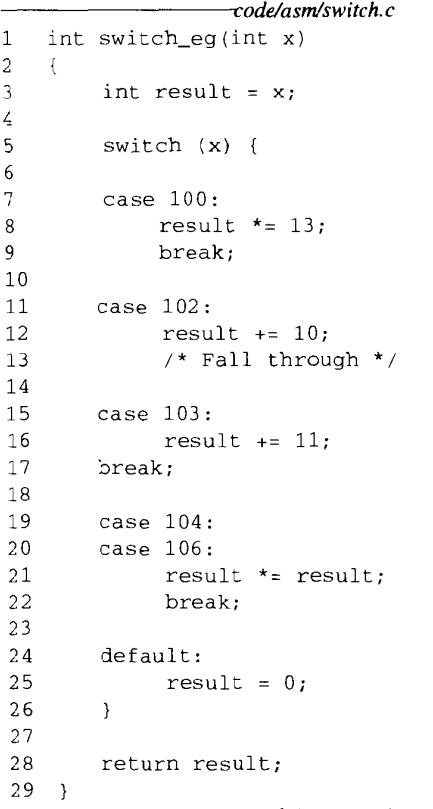
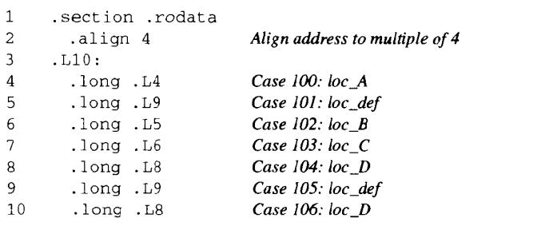

# Chapter.3 程序的机器级表示

--------------

## 3.6 控制

### 3.6.6 循环

使用条件测试和条件组合来实现循环的效果  
`大多数汇编器会根据一个循环的 do-while 形式来产生循环代码`

do-while的通用模板如下

```
loop:
    body-statement
    t = test-expr;
    if(t)
        goto loop;
```

比如斐波那契

```cpp
int fib_dw(int n){
    int i=0;
    int val = 0;
    int nval = 1;

    do{
        int t = val + nval;
        val = nval;
        nval = t;
        i++;
    }while(i < n);

    return val;
}
```

```
%ecx i
%esi n
%ebx val
%edx nval
%eax t
```

汇编代码

```
.L6:
    leal (%edx,%ebx),%eax   计算t = val+nval
    movl %edx,%ebx          复制nval到val
    movl %eax,%edx          复制t到nval
    incl %ecx               i自加
    cmpl %esi,%ecx          比较i和n
jl .L6                  如果小于,跳回L6
movl %ebx,%eax          设置return值
```


while 只需要特判第一次判断就可以转为 do-while 了  
for 也需要转为 do-while 减少分支跳转次数

--------------

### 3.6.7 switch语句

如果switch的数量比较多并且范围跨度比较小的时候,GCC会使用`跳转表`来加速switch

比如如下代码



就会生成如下跳转表



这个是`间接转移`,即有效地址是由`.L10`指定的基地址加上`xi(放在寄存器%eax中)`的伸缩值确定的  

最后会生成如下代码


--------------


> Latex转Svg

https://www.latexlive.com/