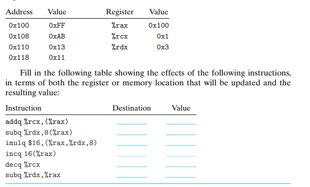

## 3.5.2 Unary and Binary Operations

## 习题3.8



| Destination | Value |   答案      |
| ----------- | ----- |  ----       |
| 0x100       |   0   |     0x100(有进位的)   |
| 0x108       |  0xA3 |     0xA8    |
| 0x118       |  0x10 |     0x110   |
| 0x100(应为0x100)       |  0x0F |     0x14    |
| %rcx        |   0   |
| %rax        | 0xfd  |


## 3.5.3 Shift Operations

不同的shift指令可以选择位移作为一个整数，或者作为一个字节寄存器的值`%cl`，
不过这个寄存器只有相应的位才被使用，比如 我当前左移的是一个字节`salb`那么只用4bit的`%cl`
假设此时`%cl`是`0xff`那么只左移7位。

## 习题3.9

```c
long shift_left4_rightn(long x, long n) {
    x <<= 4;
    x >>= n;
    return x;
}
```

补全汇编：
```
movq %rdi, %rax
sal $4, %rax // salq
movq %esi, %ecx
sar %ecx, %rax //sarq %cl
ret
```

## 习题3.10

反汇编:
```
short arith3(short x, short y, short z) {
    z = y | z;
    z = z >> 9;
    z = ~z;
    p4 = y - z;
}


