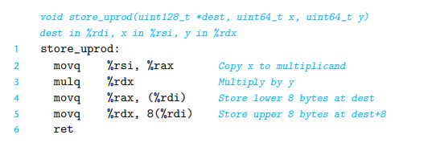
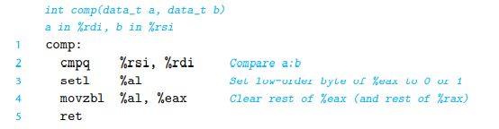

## 3.5.5 Special Arighmetic Operations

对于64位乘法来说，由于会溢出，一种办法是使用`%rdx, %rax`合起来看作是一个128位的数。



## 3.6 Control

### 3.6.1 Condition Codes

除了16个通用寄存器外，CPU维护了若干个single bit的控制码，描述最近的那个运算操作的结果，这是一些常见的：

- CF Carry flag 用来检测溢出/最高位进位
- ZF Zero flag 结果是否为0
- SF Sign flag 正负
- OF Overflow flag 补码的溢出

另外leaq并不改变这些状态码

`set`指令： 根据CF，ZF,SF,OF这些设置对应寄存器。如：



gl 是修饰有符号数的， ab是修饰无符号数的

## 习题3.13

```c
int comp(data_t a, data_t b) {
    return a COMP b;
}
```

假设a是%rdi的一部分，b是%rsi的一部分:

```c 
//1
int comp(int a, int b) {
    return a < b;
}
//2
int comp(short a, short b) {
    return a >= b;
}
//3
int comp(unsigned char a, unsigned char b) {
    return a <= b;
}
//4 
int comp((unsigned) long a, (unsigned) long b) { // 答案：也可以是pointer
    return a != b
}
```