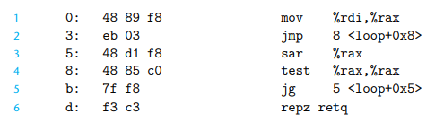

## 习题3.14
```c
int test(data_t a) {
    return a TEST 0;
}
```

假设 a存储在 `%rdi`中，正确推断可能是:
```
A 类型为 long(或者long*?) 比较符为 >=
B 类型为 (unsigned) short 比较符为 ==
C 类型为 unsigned char 比较符为 > 
D 类型为 int 比较符为 <=
```

## 3.6.3 Jump instructions

jump 指令后面接的和set差不多，如`jg,jl`表示的是有符号跳转，`ja,jb`是无符号跳转。另外还有`js,jns`表示 负数跳转和正数跳转，(个人感觉没啥用，少一次比较？)

还有一个比较不同的是indirect jump，具体来讲可以`jmp *Operand`如`jmp *%rax`表示的是跳转到(%rax)，

我们并不关心机器码是什么样子，但是理解jump指令如何编码对于学习linker是很有帮助的一件事情, 在汇编代码中，跳转地址先是一个符号表。

有多种jump的编码方式，最常用的是PC相对寻址，第二种是绝对寻址。

汇编代码：

```
    movq %rdi, %rax
    jmp .L2
.L3
    sarq %rax
.L2 testq %rax, %rax
    jg  .L3
    rep; ret
```

反汇编`.o`文件如下



我们看到 `jmp 8<loop + 0x8>` 机器码03 + 下一条起始地址5 = 8。同理`jg 5 <loop + 0x5> 机器码f8 + 下个指令d = 5


