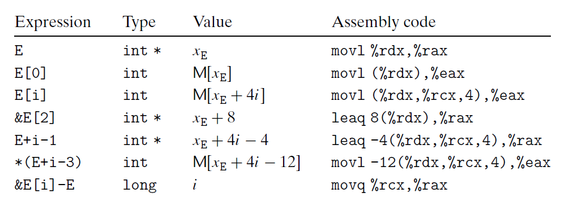

# Ch3 Machine-Level Representation of Programs

## 3.8 Array Allocation and Access

**指针运算**

某对象表达式`Expr`:  `&Expr` 为该对象地址的一个指针；

某地址表达式 `AExpr`：`*AExpr` 为该地址处的值；

Expr 等价于 `*&Expr`

数据下标和指针运算对应的汇编代码：

**嵌套数组**

多维数组在内存中按照 **行优先** 的顺序排列。

访问多维数组，编译器会以数组起始地址为基地址，偏移量为索引，产生计算期望的元素的偏移量，然后使用 `mov ` 指令。

给定数组 $T \ \mathrm{D}[R][C]$ ，$ \mathrm{D}[i][j] $ 的内存地址为：
$$
\& \mathrm{D}[\mathrm{i}][\mathrm{j}]=x_{\mathrm{D}}+L(C \cdot i+j)
$$
