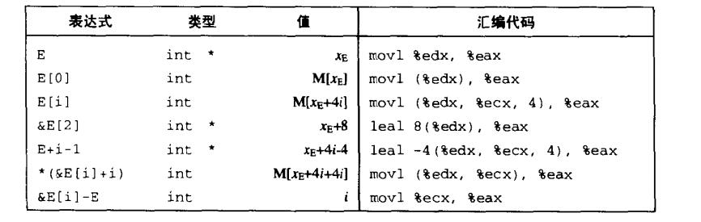

# Chapter.3 程序的机器级表示

--------------

## 3.7 过程

### 3.7.4 栈上的局部存储

书中之前大多数示例都不需要超出寄存器大小的本地存储区域,不过有些时候,局部数据必须存放在内存中.

- 寄存器不足够存放所有的本地数据
- 对一个局部变量使用地址运算符`&`,因此必须能够为它产生一个地址
- 某些局部变量是数组或结构,因此必须通过数组或结构引用被访问到。既不能普通的方式访问。

比如如下代码

```cpp
long swap_add(long *xp,long *yp){
    long x = *xp;
    long y = *yp;
    *xp = y;
    *yp = x;
    return x+y;
}

long caller(){
    long arg1 = 534;
    long arg2 = 1057;
    long sum = swap_add(&arg1,&arg2);
    long diff = arg1 - arg2;
    return sum * diff;
}
```

生成的汇编代码

```
caller:
    subq $16,%rsp
    movq $534,(%rsp)
    movq $1057,8(%rsp)
    leaq 8(%rsp),%rsi
    movq %rsp,%rdi
    call swap_add
    movq (%rsp),%rdx
    subq 8(%rsp),%rdx
    imulq %rdx,%rax
    addq $16,%rsp
    ret
```

第一句是将栈指针向下移16,即两个long类型的长度.  
然后8(%rsp) 是rsp+8,即第二个long类型的位置  

最后在离开caller时,将rsp指针上移了16,即回收内存

--------------

## 数组分配

比如访问一个int数组

```
movl (%rdx,%rcx,4),%eax
```

E的地址放在rdx,i放在rcx中

即 E(地址)+4i 的值放到%eax中


--------------

## 指针运算



## 嵌套的数组

只是计算方式和一行数组不一样

对于数组

T D[R][C]

i,j元素的地址是

&D[i][j] = x_D+L(C*i+j)

L是对应数据类型大小,x_D是首地址,


--------------


> Latex转Svg

https://www.latexlive.com/